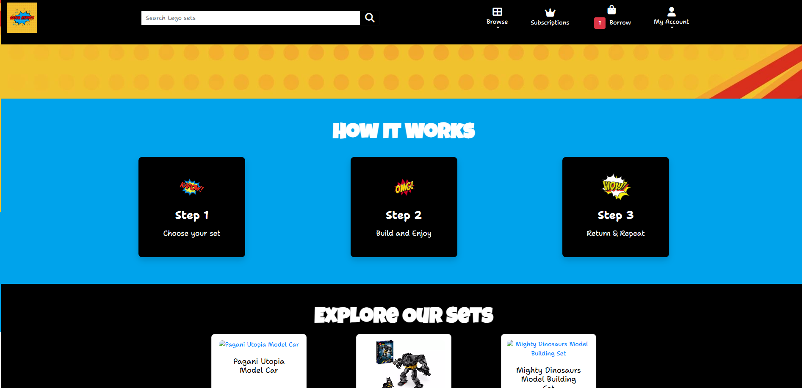

# **_Brick Heroes - Project Portfolio 5_**

Welcome to Brick Heroes, a vibrant, comic-book-inspired subscription service designed for LEGO enthusiasts of all ages! This innovative platform offers users the ability to borrow LEGO sets instead of purchasing them, making high-quality LEGO building more affordable, accessible, and sustainable.

Traditional LEGO collections can be expensive and take up space over time. With Brick Heroes, users can subscribe to a monthly plan, choose sets they want to build, borrow them for as long as they need, and return them to borrow new ones. This cycle allows for continuous creativity while reducing costs and waste.

The live site is available to view via this link: <a href="https://brick-heroes-52ffabb94b76.herokuapp.com/" target="_blank" rel="noopener">Brick Heroes</a>


# Contents

* [**Website Objectives**](#website-objectives)
* [**Agile Methodology**](#agile-methodology)
  * [**Key Agile Practices Utilised**](#key-agile-practices-utilised)
* [**User Experience (UX)**](#user-experience-ux)
  * [**Client Background and Goals**](#client-background-and-goals)
  * [**Target Audience**](#target-audience)
  * [**User Stories**](#user-stories-1)
* [**Market Research**](#market-research)
* [**Design**](#design)
  * [**Planning and Development**](#planning-and-development)
  * [**Colour Scheme and Typography**](#colour-scheme-and-typography)
* [**Data Model**](#data-model)
* [**General Features**](#general-features)
* [**Page-Specific Features**](#page-specific-features)
  * [**Home Page Features**](#home-page-features)
  * [**Subscription Page Features**](#subscription-page-features)
  * [**Browse Lego Sets**](#browse-lego-sets)
  * [**Lego Set Detail Page**](#lego-set-detail-page)
  * [**Borrow Cart Page**](#borrow-cart-page)
  * [**User Profile Page**](#user-profile-page)
  * [**Manage Store Page**](#manage-store-page)
  * [**Admin Notifications**](#admin-notification)
  * [**Register, Login and Logout**](#register,-login-and-logout)
  * [**Django Allauth: Custom Templates & Email Management**](#django-allauth:-custom-templates-&-email-management)
* [**Technologies Used**](#technologies-used)
* [**Deployment**](#deployment)
* [**Testing**](#testing)
* [**Bugs**](#bugs)
* [**Credits**](#credits)
* [**Acknowledgements**](#acknowledgements)

# Website Objectives

The Brick Heroes website is designed to provide a comprehensive platform for users to explore and purchase Lego sets through a subscription-based model. The primary goal is to create an engaging, user-friendly space that empowers builders of all ages to access a wide variety of Lego sets affordably, while also promoting sustainability through the reuse of sets. The site integrates borrowing functionality and e-commerce subscription management, ensuring a seamless experience for users.

Additionally, Brick Heroes aims to foster a creative community of Lego enthusiasts by offering features such as a Facebook page where customers can share building tips, share creations, and the ability to leave reviews and feedback on borrowed sets. The website's design reflects a vibrant, comic-book-inspired theme to make the browsing and interaction experience fun and memorable.


**Key objectives:**
1. **Subscription Management**
  - Enable users to view, select, and manage subscription plans, including monthly options, with clear pricing and benefits.
  - Provide flexible management tools for upgrading, downgrading, or cancelling subscriptions.

2. **Borrowing and Returning Sets**
  - Offer a seamless borrowing system where users can browse and filter sets by theme, difficulty, and availability.
  - Allow users to borrow sets and return them easily, with clear stock availability.

3. **Creative Engagement**
  - Foster community interaction through features like user reviews and ratings.
  - Create a social media platform for users to share tips, reviews, and Lego news.

5. **Accessibility and Usability**
  - Ensure the site is fully responsive and accessible, providing a smooth experience across devices, including mobile, tablet, and desktop.
  - Use an intuitive design and navigation structure to simplify browsing and borrowing for all users.

6. **Sustainability Focus**
  - Promote eco-friendly practices by encouraging the reuse of Lego sets, reducing waste, and minimising the environmental impact of toy consumption.

7. **Administrator Tools**
  - Provide a robust admin interface for managing Lego sets, monitoring user activity, and moderating reviews.
  - Include tools to track subscriptions, reviews and borrowing.

8. **Notifications and Feedback**
  - Keep users informed with timely notifications such as subscription renewals.
  - Encourage user feedback to continuously improve the service and offerings.

By focusing on these objectives, Brick Heroes aims to become the go-to platform for affordable and creative Lego set access while building a supportive and enthusiastic community of builders.

[Back to top](<#contents>)

# Agile Methodology

## Agile Methodology

Throughout the development of the Brick Heroes platform, Agile methodology was implemented to ensure the project was completed efficiently while remaining flexible to evolving requirements. This iterative approach emphasized incremental delivery, continuous improvement, and alignment with user needs, allowing the project to adapt as feedback was incorporated. Agile principles helped manage the project's scope, prioritise key features, and maintain a high standard of quality.

### Key Agile Practices Utilised:

1. **Sprint Planning and Milestones**

The development process was broken into multiple milestones, each representing a major feature or section of the site (e.g., User Authentication, Subscription Management, Borrowing and Returning Lego Sets).

  - Each milestone was treated as a sprint, with specific goals and a clear timeline for delivery.
  - Deadlines were set for each sprint but remained flexible, allowing adjustments to address high-priority features first or respond to feedback.
  - Examples of milestones included:
      - Setting up the user authentication system.
      - Developing the borrowing and returning workflows.
      - Implementing e-commerce functionality for subscriptions and potential future ecommerce options.

This iterative structure ensured steady progress while maintaining the flexibility to pivot when necessary.

2. **User Stories**

User stories were at the heart of the development process, capturing features and functionality from the perspective of different user types (e.g., subscribers, admins, and visitors).

  - Each user story was written to reflect specific user goals, helping to focus on delivering value.
  - Prioritisation followed the MoSCoW framework:
      - Must Have: Core functionality like account registration, borrowing Lego sets, and subscription management.
      - Should Have: Features enhancing usability, such as filtering Lego sets by theme or difficulty.
      - Could Have: Community features like buying gift cards and sets, a blog for sharing Lego creations or commenting on blog posts.
  - User stories provided clear acceptance criteria to guide development and testing, ensuring that each feature met user expectations.

3. **GitHub Project Board**

A dedicated GitHub Projects board was created to organise and track tasks, user stories, and features.

  - The board was divided into columns, such as:
      - Backlog: Features or tasks awaiting prioritisation.
      - In Progress: Current tasks under development.
      - Testing: Completed tasks undergoing testing and validation.
      - Done: Completed and deployed features.
  - Each user story was assigned to its relevant sprint and tracked on the board to ensure visibility into the development process.
  - For example, once the "Implement Monthly Subscription Workflow" user story was completed, it was moved from In Progress to Done.

This structure provided transparency, allowed blockers to be identified early, and ensured smooth progress through each sprint.

   [GitHub Project Board - Brick Heroes](https://github.com/users/SophieMcGee/projects/3)

4. **Regular Retrospectives**

At the end of each sprint, retrospectives were conducted to reflect on the process and identify areas for improvement.

  - Key questions included:
      - What went well?
      - What challenges were encountered?
      - What can be improved in the next sprint?
  - Retrospectives allowed for:
      - Addressing technical debt.
      - Streamlining processes to improve delivery times.
      - Enhancing collaboration and decision-making for future tasks.

These reflective sessions ensured the development process remained agile and adaptable.

5. **Continuous Integration and Testing**

To maintain a robust and reliable codebase, continuous integration principles were applied.

  - Each feature was developed and tested in isolation, ensuring it met the acceptance criteria before being integrated into the main project.
  - Testing focused on:
      - Functional testing for core features (e.g., borrowing Lego sets, subscription management).
      - Validation of edge cases (e.g., handling expired subscriptions or unavailable sets).
   - Automated tests were created for critical features to ensure they worked as intended across updates.
   - Any issues identified during testing were documented in GitHub Issues and addressed promptly, preventing regressions and maintaining site stability.

6. **Prioritisation Using MoSCoW**

The MoSCoW method was used to prioritize user stories and features systematically:

  - Must Have: User registration, borrowing and returning Lego sets, subscription payments.
  - Should Have: User reviews and ratings for Lego sets, notifications.
  -	Could Have: A gallery for users to share their builds, blog area, purchasing of sets and giftcards.
  - Won’t Have: Features planned for future phases, like multi-language support or advanced analytics for users.

This approach ensured that critical functionality was delivered first while leaving room for enhancements later in the project lifecycle.


# User Experience (UX)

## Client Background and Goals

The Brick Heroes platform is designed to provide a seamless and engaging space for Lego enthusiasts to access a subscription-based service for borrowing Lego sets. As the developer and someone passionate about creativity and sustainability, I recognised the need for a platform that simplifies access to high-quality Lego sets while promoting reuse and reducing waste. The goals for this website include:

* **Catering to a wide user base:** – The platform is designed for a diverse audience, from casual hobbyists to avid builders and parents looking for fun, cost-effective activities for their children.
* **Ease of use and accessiblity** – A clean, intuitive interface ensures users can browse Lego sets, manage subscriptions, and complete transactions effortlessly on any device.
* **Fostering creativity and community** – The platform promotes user engagement by providing tools to review and rate sets, with links to a newsletter and social media.
* **Clear pathways for action** – Strategically placed calls-to-action (CTAs) guide users to subscribe, borrow, purchase, ensuring a smooth user journey.
* **Sustainability and value** – By encouraging borrowing and reuse, the site offers a cost-effective and environmentally friendly way to enjoy Lego sets.

[Back to top](#contents)


## Target Audience

Based on research into the Lego community and subscription services, Brick Heroes is designed to serve the following target audiences:

* **1.	Families and parents:**
    - Parents looking for affordable, fun, and educational activities for their children.
    - Families interested in borrowing rather than purchasing expensive Lego sets.

* **2.	Avid Lego enthusiasts:**
    - Builders seeking access to a variety of sets to fuel their creativity without the commitment of ownership.
    - Hobbyists looking for exclusive or themed sets that might not be available for purchase elsewhere.

* **3.	Gift Shoppers:**
    - Individuals searching for creative gift options, such as subscriptions.

* **4.	Sustainability-conscious users::**
    - Individuals who value eco-friendly alternatives to toy consumption and appreciate the platform's focus on reuse and sharing.

* **5.	Community-oriented Lego fans:**
    - Builders who enjoy sharing their creations, leaving reviews, and engaging with news about Lego themes and techniques.

[Back to top](#contents)

## User Stories

**User Stories Summary**

Below is a table summarising the milestones/epics for the Brick Heroes platform. Each milestone represents a key area of focus during the development process and includes user stories designed to achieve specific goals. Doe to time constaints and the fact this is a project that is submitted as part of my course, these will be fully developed as my coding knowledge and abilities develop. As explained above, areas within these user stories will focus on must have, should have and could have, with some developments saved for future implementation that are not essential to the core objectives of the app.

| **Milestone**                     | **Summary**                                                                                          |
|------------------------------------|------------------------------------------------------------------------------------------------------|
| **Frontend Design**                | Focuses on visual and functional aspects of the site, including the favicon, layout consistency, subscription pricing details, and responsiveness across devices. |
| **User Account and Authentication** | Handles core user management features such as account registration, login/logout, email verification, password reset, and profile updates. |
| **Subscription Management**        | Implements subscription workflows, including selecting, upgrading, downgrading, and canceling plans, as well as sending renewal reminders. |
| **Borrowing and Returning Lego Sets** | Manages the core functionality of borrowing and returning Lego sets, including waitlists for unavailable sets and filtering options for browsing. |
| **E-Commerce Features**            | Provides e-commerce functionality for purchasing Lego sets and gift cards, as well as redeeming gift cards during checkout. |
| **Blog and Community Interaction**  | Encourages engagement by allowing users to read blog posts, share Lego creations in a gallery, and participate in community-driven features. |
| **Administrator Tools**            | Focuses on administrative functionality, such as managing Lego sets, moderating user reviews, and viewing subscription and order analytics. |
| **Notifications and Feedback**      | Ensures users receive confirmation emails for actions such as subscriptions, purchases, and borrowing to provide clear communication and feedback. |
| **Testing and Documentation**      | Covers writing and running automated tests for key features and creating comprehensive user and developer documentation, including deployment instructions. |

[Back to top](#contents)

Each user story within the milestones is categorised and tracked through the GitHub Project Board, ensuring iterative development and task completion. Below is a breakdown of user stories associated with each milestone.

## **Detailed User Stories**

### **Frontend Design**

<details><summary><b>User Story: View the site favicon</b></summary>

* **Issue**: As a user, I can see a recognisable favicon in the browser tab so that I can easily identify Brick Heroes when multiple tabs are open.

#### **Acceptance Criteria:**
- A favicon related to the site's branding is displayed in all browsers.
- The favicon is clear and visible across different devices.

* **Label**: Could Have  
* **Milestone**: Frontend Design  
</details><hr>

<details><summary><b>User Story: See a consistent theme across the site</b></summary>

* **Issue**: As a user, I can experience a consistent comic-book-inspired design across all pages so that I enjoy a cohesive and fun browsing experience.

#### **Acceptance Criteria:**
- Header, footer, and colour schemes are consistent.
- The comic-book theme is applied through bold fonts, colourful highlights, and speech-bubble-style buttons.
- All pages are responsive and adapt to different devices.

* **Label**: Must Have  
* **Milestone**: Frontend Design  
</details><hr>

<details><summary><b>User Story: View subscription pricing details</b></summary>

* **Issue**: As a user, I can view subscription plans with clear pricing and features so that I can make an informed decision.

#### **Acceptance Criteria:**
- The homepage includes a pricing table with subscription tiers.
- Each tier displays the price, borrowing limits, and unique benefits.
- A clear call-to-action button for each plan is available.

* **Label**: Must Have  
* **Milestone**: Frontend Design  
</details><hr>

### **User Account and Authentication**

<details><summary><b>User Story: Register an account</b></summary>

* **Issue**: As a new user, I can create an account so that I can start borrowing sets and managing subscriptions.

#### **Acceptance Criteria:**
- The registration form includes fields for name, email, and password.
- A success message confirms the account creation.
- Users are redirected to their dashboard after signing up.

* **Label**: Must Have  
* **Milestone**: User Account and Authentication  
</details><hr>

<details><summary><b>User Story: Receive email verification</b></summary>

* **Issue**: As a user, I can verify my email address so that I can activate my account securely.

#### **Acceptance Criteria:**
- After registration, a verification email is sent automatically.
- Clicking the link activates the user account.
- A notification displays if the email is successfully verified.

* **Label**: Must Have  
* **Milestone**: User Account and Authentication  
</details><hr>

<details><summary><b>User Story: Log in to my account</b></summary>

* **Issue**: As a user, I can log in to my account so that I can manage my subscriptions and borrow sets.

#### **Acceptance Criteria:**
- Login form with email and password fields.
- Incorrect login attempts display an error message.
- Successful login redirects to the dashboard.

* **Label**: Must Have  
* **Milestone**: User Account and Authentication  
</details><hr>

<details><summary><b>User Story: Reset my password</b></summary>

* **Issue**: As a user, I can reset my password if I forget it so that I can regain access to my account.

#### **Acceptance Criteria:**
- A password reset link is sent to the user's email.
- Users can securely create a new password.

* **Label**: Must Have  
* **Milestone**: User Account and Authentication  
</details><hr>

<details><summary><b>User Story: Update my profile</b></summary>

* **Issue**: As a user, I can update my account details so that my information stays current.

#### **Acceptance Criteria:**
- Editable fields for name, email, and password.
- Changes are saved and confirmed.

* **Label**: Should Have  
* **Milestone**: User Account and Authentication  
</details><hr>

### **Subscription Management**

<details><summary><b>User Story: Select a subscription plan</b></summary>

* **Issue**: As a user, I can choose a subscription plan so that I can start borrowing Lego sets.

#### **Acceptance Criteria:**
- Subscription options are listed during registration or on the homepage.
- Users can pick a monthly or annual plan.
- Payment processing confirms the selected plan.

* **Label**: Must Have  
* **Milestone**: Subscription Management  
</details><hr>

<details><summary><b>User Story: Upgrade or downgrade my subscription</b></summary>

* **Issue**: As a user, I can adjust my subscription plan so that I can find the one that best fits my needs.

#### **Acceptance Criteria:**
- Users can view their current plan in the account dashboard.
- Options to upgrade or downgrade are available.
- Plan changes take effect on the next billing cycle.

* **Label**: Should Have  
* **Milestone**: Subscription Management  
</details><hr>

<details><summary><b>User Story: Cancel my subscription</b></summary>

* **Issue**: As a user, I can cancel my subscription so that I am no longer charged.

#### **Acceptance Criteria:**
- A cancel button is accessible in the account dashboard.
- Users receive a confirmation email after cancellation.
- Account access remains, but borrowing privileges are suspended.

* **Label**: Should Have  
* **Milestone**: Subscription Management  
</details><hr>

<details><summary><b>User Story: Receive subscription renewal reminders</b></summary>

* **Issue**: As a user, I can get email reminders about upcoming subscription renewals so that I stay informed.

#### **Acceptance Criteria:**
- Reminder email sent 7 days before renewal.
- Email includes subscription details and a link to manage the subscription.

* **Label**: Should Have  
* **Milestone**: Subscription Management  
</details><hr>

### **Borrowing and Returning Lego Sets**

<details><summary><b>User Story: Browse available Lego sets</b></summary>

* **Issue**: As a user, I can browse all available Lego sets so that I can choose one to borrow.

#### **Acceptance Criteria:**
- Lego sets are displayed in a grid format.
- Filters allow sorting by theme, difficulty, and availability.
- Clicking a set displays detailed information.

* **Label**: Must Have  
* **Milestone**: Borrowing and Returning Lego Sets  
</details><hr>

<details><summary><b>User Story: Borrow a Lego set</b></summary>

* **Issue**: As a user, I can borrow a Lego set so that I can start building.

#### **Acceptance Criteria:**
- Users can add an available set to their "Borrowed Items."
- Borrowed sets are marked as unavailable to other users.
- A confirmation email is sent upon successful borrowing.

* **Label**: Must Have  
* **Milestone**: Borrowing and Returning Lego Sets  
</details><hr>

<details><summary><b>User Story: Return a Lego set</b></summary>

* **Issue**: As a user, I can return a borrowed set so that I can borrow a new one.

#### **Acceptance Criteria:**
- Users can mark sets as returned in their dashboard.
- The set's availability is updated in the database.
- A confirmation message appears upon successful return.

* **Label**: Must Have  
* **Milestone**: Borrowing and Returning Lego Sets  
</details><hr>

<details><summary><b>User Story: Join a waitlist for unavailable Lego sets</b></summary>

* **Issue**: As a user, I can join a waitlist for a Lego set so that I’m notified when it becomes available.

#### **Acceptance Criteria:**
- Waitlist button appears for unavailable sets.
- Notification sent when the set becomes available.

* **Label**: Could Have  
* **Milestone**: Borrowing and Returning Lego Sets  
</details><hr>

---

### **E-Commerce Features**

<details><summary><b>User Story: Purchase a Lego set</b></summary>

* **Issue**: As a user, I can buy a Lego set outright so that I can own my favourite builds.

#### **Acceptance Criteria:**
- Lego sets for sale are clearly marked.
- The checkout process includes payment confirmation.
- Purchased sets are excluded from the borrowing pool.

* **Label**: Could Have  
* **Milestone**: E-Commerce Features  
</details><hr>

<details><summary><b>User Story: Buy a gift card</b></summary>

* **Issue**: As a user, I can purchase a gift card so that I can share the Brick Heroes experience with someone else.

#### **Acceptance Criteria:**
- Gift cards have multiple denominations available.
- A confirmation email with a unique gift card code is sent.
- Gift card codes can be redeemed during checkout.

* **Label**: Could Have  
* **Milestone**: E-Commerce Features  
</details><hr>

<details><summary><b>User Story: Redeem a gift card</b></summary>

* **Issue**: As a user, I can redeem a gift card code during checkout so that I can use its value toward my purchase.

#### **Acceptance Criteria:**
- Gift card field is present in the checkout form.
- Gift card value is applied to the total.

* **Label**: Could Have  
* **Milestone**: E-Commerce Features  
</details><hr>

---

### **Blog and Community Interaction**

<details><summary><b>User Story: View blog articles</b></summary>

* **Issue**: As a user, I can read blog posts about Lego tips and news so that I stay inspired.

#### **Acceptance Criteria:**
- Blog page displays a list of posts with thumbnails and snippets.
- Clicking a post opens the full article.

* **Label**: Should Have  
* **Milestone**: Blog and Community Interaction  
</details><hr>

<details><summary><b>User Story: Submit Lego creations to the gallery</b></summary>

* **Issue**: As a user, I can share my Lego builds in a gallery so that I inspire others.

#### **Acceptance Criteria:**
- Users can upload images and captions.
- Creations are reviewed before being displayed.

* **Label**: Could Have  
* **Milestone**: Blog and Community Interaction  
</details><hr>

---

### **Administrator Tools**

<details><summary><b>User Story: Manage Lego sets</b></summary>

* **Issue**: As an admin, I can add, edit, or delete Lego sets so that the catalogue stays up to date.

#### **Acceptance Criteria:**
- Admin panel includes controls for Lego set management.
- Changes reflect immediately on the site.

* **Label**: Must Have  
* **Milestone**: Administrator Tools  
</details><hr>

<details><summary><b>User Story: Moderate reviews and comments</b></summary>

* **Issue**: As an admin, I can approve or delete user reviews and comments so that the site maintains a positive environment.

#### **Acceptance Criteria:**
- Admins see flagged or pending comments in the dashboard.
- Options to approve or delete are available.

* **Label**: Should Have  
* **Milestone**: Administrator Tools  
</details><hr>

<details><summary><b>User Story: View subscription analytics</b></summary>

* **Issue**: As an admin, I can view subscription statistics so that I understand user engagement.

#### **Acceptance Criteria:**
- Reports include active subscriptions, cancellations, and revenue.
- Filters for monthly and yearly views are available.

* **Label**: Could Have  
* **Milestone**: Administrator Tools  
</details><hr>

<details><summary><b>User Story: View order history</b></summary>

* **Issue**: As an admin, I can view user order histories so that I can resolve disputes or answer questions.

#### **Acceptance Criteria:**
- Order details are displayed in the admin panel.
- Orders can be filtered by user or date.

* **Label**: Should Have  
* **Milestone**: Administrator Tools  
</details><hr>

---

### **Notifications and Feedback**

<details><summary><b>User Story: Receive confirmation emails</b></summary>

* **Issue**: As a user, I can get confirmation emails for subscriptions, purchases, and borrowing so that I know my actions were successful.

#### **Acceptance Criteria:**
- Email includes details of the action.
- Email is sent promptly after the action.

* **Label**: Must Have  
* **Milestone**: Notifications and Feedback  
</details><hr>

---

### **Testing and Documentation**

<details><summary><b>User Story: Run automated tests</b></summary>

* **Issue**: As a developer, I can write and run automated tests so that I ensure the site works as intended.

#### **Acceptance Criteria:**
- Test scripts cover key functionalities like login, checkout, and subscriptions.
- Tests pass consistently without errors.

* **Label**: Must Have  
* **Milestone**: Testing and Documentation  
</details><hr>

<details><summary><b>User Story: Write user documentation</b></summary>

* **Issue**: As a developer, I can write documentation for the site so that users understand how to use its features.

#### **Acceptance Criteria:**
- Documentation includes step-by-step guides for subscriptions, borrowing, and purchases.
- Available as a help section on the site.

* **Label**: Must Have  
* **Milestone**: Testing and Documentation  
</details><hr>

<details><summary><b>User Story: Write deployment instructions</b></summary>

* **Issue**: As a developer, I can document deployment steps so that the site can be redeployed easily.

#### **Acceptance Criteria:**
- Instructions cover setting up the database, environment variables, and dependencies.
- Deployment is successfully replicated using the documentation.

* **Label**: Should Have  
* **Milestone**: Testing and Documentation  
</details><hr>


There are several areas within the Brick Heroes GitHub Projects that remain open and are marked as 'To Do' or 'In Progress', reserved for future development to further enhance the platform's functionality and user experience. These features are part of the platform's long-term vision to remain innovative, user-centric, and scalable, although these future developments are not essential to the main core functionality now.

# Future Development Areas

## 1. Enhanced Borrowing Experience
- **Feature Idea:** Introduce a recommendation engine that suggests Lego sets based on borrowing history or user preferences.
- **Feature Idea:** Enable users to preview digital building instructions for sets to assess difficulty before borrowing.

## 2. Administrator Tools
- **Feature Idea:** Advanced review moderation tools to flag inappropriate or spam content automatically using machine learning algorithms.
- **Feature Idea:** Real-time analytics dashboard for monitoring site activity, including borrowing trends, subscription growth, and most popular sets.

## 3. Community and Engagement Features
- **Feature Idea:** Gamify the borrowing experience with a rewards system that grants points for timely returns, submitting reviews, or referring friends. Points could be redeemed for discounts or exclusive perks.
- **Feature Idea:** Add user profiles with public-facing elements, such as badges for frequent borrowers or top reviewers.
- **Feature Idea:** Introduce user forums or discussion boards where Lego enthusiasts can exchange ideas, tips, or organise building challenges.

## 4. Expanded E-Commerce Options
- **Feature Idea:** Offer exclusive Lego sets or accessories for sale, such as gift cards, storage boxes and build tables.
- **Feature Idea:** Develop a gift subscription option where users can purchase a subscription plan as a gift for someone else.
- **Feature Idea:** Add bundles combining subscriptions with discounted merchandise or Lego-themed items.

## 5. Improved Accessibility and Usability
- **Feature Idea:** Implement multilingual support to attract users from diverse regions.
- **Feature Idea:** Add voice search capabilities for browsing Lego sets, enhancing accessibility for users with visual impairments.
- **Feature Idea:** Incorporate dark mode to improve usability for users browsing at night or with light sensitivity.

## 6. Notifications and Feedback
- **Feature Idea:** Enable push notifications for browser and mobile users to alert them of waitlist availability, new arrivals, or upcoming due dates.

## 7. Sustainability and Eco-Focused Features
- **Feature Idea:** Add a sustainability tracker showing the positive environmental impact of borrowing versus purchasing sets outright.
- **Feature Idea:** Partner with other businesses to promote eco-friendly bricks or sets made from sustainable materials.
- **Feature Idea:** Introduce a feature for users to donate unused sets back to the platform for others to borrow.


## Commitment to Growth
These open tasks and feature ideas reflect **Brick Heroes'** commitment to continuous improvement, innovation, and creating a robust platform. By focusing on these potential enhancements, the site will remain scalable, engaging, and aligned with user needs while contributing positively to the Lego community and environmental sustainability. These ideas form the foundation of the platform's long-term roadmap, ensuring it evolves to meet the expectations of its growing audience.

[Back to top](<#contents>)

## Market Research

The development of Brick Heroes was informed by comprehensive market research to ensure the platform effectively meets user needs and stands out in the LEGO® rental and subscription service industry. This research encompassed understanding user expectations, analysing competitors, and identifying design trends to create a functional and user-friendly platform.

### Competitor Analysis

An in-depth analysis of existing LEGO® rental and subscription services was conducted to understand market trends, user preferences, and areas for improvement. This analysis provided valuable insights into service offerings, pricing models, and user engagement strategies.

Key competitors:

- **[Brick Borrow](https://www.brickborrow.com/)**: A UK-based service offering a sustainable monthly subscription to borrow LEGO® sets at affordable prices. Users can choose sets to borrow, build, and return, with delivery handled via Royal Mail's Tracked 48 service.
- **[Stud Universe](https://studuniverse.com/)**: Offers a cost-effective LEGO® subscription service with a wide range of sets and a 30-day play guarantee. The service emphasizes affordability, variety, and customer satisfaction.
- **[Brick Club UK](https://www.ticketmaster.com/)**: Specialises in Technic LEGO® subscriptions for Adult Fans of LEGO (AFOLs), providing various subscription tiers and access to exclusive sets. The service focuses on delivering high-quality Technic sets to enthusiasts.
- **[Brick Loot](https://www.brickloot.com/)**: A subscription box service for LEGO® and brick fans, delivering monthly boxes filled with custom LEGO® kits, minifigures, light kits, and compatible products. The service caters to both children and adult collectors.

#### Insights Gained:
- **Service Offerings:** Competitors provide a range of services, from simple set rentals to curated subscription boxes with exclusive items. Understanding these offerings helped identify opportunities for differentiation, such as focusing on specific LEGO® themes.
- **Pricing Models:** Subscription plans vary, with options for monthly or annual payments, different tiers based on the number of sets borrowed, and special plans for exclusive sets. Analysing these models informed the development of competitive and flexible pricing strategies for Brick Heroes.
- **User Engagement:** Features such as user reviews, community galleries, and reward systems are employed to enhance engagement. Incorporating similar features can foster a vibrant community and encourage repeat usage.
- **Logistics and Accessibility:** Efficient delivery and return processes, clear terms and conditions, and responsive customer service are critical for user satisfaction. Ensuring these elements are optimised can enhance the overall user experience.

By leveraging these insights, Brick Heroes aims to offer a distinctive and superior service in the LEGO® rental and subscription market, focusing on user-centric features, flexible pricing, and exceptional customer engagement.

#### Design Implications

Based on the competitor analysis, there were several design ideas that shaped the structure and features of Brick Heroes. These insights ensured the platform offers a seamless, engaging, and user-friendly experience for its diverse audience.

- **Clear Lego Set Listings**:
  - •	Borrowing Focus: Each Lego set is displayed with clear, relevant details, including the set name, theme, difficulty level, and availability (e.g., Available, Reserved, Borrowed).
  - Detailed View: Users can click on a Lego set to view more information, such as a description, high-quality images, and user reviews.
  - Filtering Options: Filters for themes (e.g., Star Wars, Technic), difficulty levels, and user ratings were included to make browsing intuitive and efficient.
  
- **User Feedback and Community Interaction**:
  - Set Reviews and Ratings: Borrowers can leave reviews and rate sets, helping others identify popular or highly-rated sets.
  - Community: Facebook page allowing users to share photos of their builds with borrowed sets fosters community engagement and provides inspiration for other users, alongside a newsletter.
  
- **Simple and Intuitive Navigation**:
  - Streamlined Navigation Menu: A clean, easy-to-use navigation bar allows users to quickly find essential pages, such as Browse Sets, My Account, and Subscription Plans.
  - Quick Access Buttons: Prominent buttons direct users to key actions like "Borrow" "Return Set," or "Subscribe."
  
- **Engaging Calls-to-Action (CTAs)**:
  - Subscription Incentives: Eye-catching CTAs on the homepage encourage users to "Join" or "Explore Subscription Plans," highlighting the value and affordability of the service.
  - Borrowing and Returning: Buttons are prominently displayed on user profile and set pages for quick access to key actions.
  
- **Consistent Branding**:
  - Comic-Inspired Design: A bold, colourful comic-book style with speech-bubble buttons and playful typography is used throughout the platform, reflecting the fun and creative nature of the service.
  - Cohesive Colour Scheme: A bright, consistent palette ensures the platform feels cohesive and professional while remaining visually appealing to users of all ages.
  - Thematic Icons: Custom icons representing Lego bricks are used to reinforce the theme.
  
- **Mobile Accessibility**:
  - Fully Responsive Design: The platform is designed to adapt seamlessly to mobile, tablet, and desktop devices, ensuring a smooth experience across all screen sizes.
  - Mobile-First Interactions: Key actions like subscribing, browsing sets, and accessing user profiles are optimised for mobile users with touch-friendly buttons and simplified layouts.

  These design decisions ensure that Brick Heroes not only meets current user expectations but also stands out in the market with a fun, functional, and engaging platform. By focusing on clarity, user interaction, and mobile responsiveness, the platform provides a superior experience that appeals to Lego enthusiasts of all ages.

  [Back to top](<#contents>)


# Design

## Design Planning and Development

The planning and development of the Brick Heroes platform were driven by a user-focused approach to ensure a seamless, enjoyable, and accessible experience. By utilising the five planes of UX—Strategy, Scope, Structure, Skeleton, and Surface—the design process aimed to craft a visually dynamic and highly functional platform. Each phase prioritized the needs of Lego enthusiasts, creating an ecosystem where borrowing, purchasing, and interacting with Lego sets feels effortless and fun.

### Strategy

The strategic phase centred on identifying user needs and setting clear goals for the platform. The vision for Brick Heroes is to empower users to enjoy Lego sets through an affordable subscription service, while fostering creativity and sustainability. The strategy focused on:

-	Making Lego Accessible: Providing a cost-effective solution for families, hobbyists, and enthusiasts by offering a variety of subscription tiers.
-	Encouraging Community: Introducing features like reviews, ratings, and social media page promoting interaction among members.
-	Simplifying Borrowing: Creating a streamlined process for discovering and returning Lego sets.

The strategy was informed by competitor research, user surveys, and market analysis to ensure the platform aligns with user expectations and stands out in the market.


### Scope

Building on the strategy, the scope defined the essential features needed to deliver a robust user experience. Emphasis was placed on designing intuitive workflows for browsing sets, managing subscriptions, and encouraging creative participation.
Key features included in the scope:


The scope includes the following pages and functionalities:
- **Homepage**: Highlights subscription benefits, featured Lego sets, and calls-to-action encouraging users to join or explore.
- **Main Product Page**: Provides tools for filtering sets by theme, difficulty, and rating, ensuring a user-centric browsing experience.
- **Product Detail Pages**: Displays comprehensive information about each Lego set, including photos, descriptions, and user feedback.
- **User Profile**: Offers a centralised hub for users to track borrowed sets, return items, and manage their subscriptions.
- **Admin Store Management**: Equips administrators with tools to add, edit and delete sets, moderate user content, and monitor platform activity.

The scope ensured that all essential functionalities were addressed while leaving room for future enhancements, such as gamification and advanced analytics.

### Structure

The structure phase focused on organizing content and features into a logical, user-friendly flow. The goal was to guide users naturally through the platform, making it easy to find Lego sets, manage subscriptions, and interact with the community.
Key structural elements included:

- **Simplified Navigation:**: A fixed menu allows users to move seamlessly between key sections such as the homepage, Browse Sets, and My Account.
- **Focused User Workflows**: Designed intuitive paths for tasks like borrowing sets, purchasing subscriptions, and leaving reviews.
- **Filtering and Sorting Tools:**: Enabled users to refine search results by themes, ratings, or difficulty to quickly locate their desired sets.
- **Call to action Placement**: Strategically positioned buttons like "Subscribe Now" and "Borrow" to maximise engagement and simplify decision-making.

The platform’s structure ensures that all interactions, from browsing to community engagement, are straightforward and efficient.

### Skeleton

Wireframes played a crucial role in defining the visual layout and interaction design of the platform. The focus was on clarity and usability, ensuring the platform feels intuitive for users of all ages.
Key considerations during this phase:

- **Mobile-First Design**: Wireframes prioritized mobile accessibility to reflect the increasing number of users browsing on phones and tablets.
- **Content Prioritisation**: Essential information, such as subscription details and set availability, was placed prominently to reduce scrolling.
- **Interactve Features**: Included elements like filters, dynamic search, and review submission tools to encourage user engagement.
- **Guided Actions**: Visual cues and layouts were designed to guide users naturally through tasks, such as selecting a subscription or reserving a set.

Below are the wireframes created for the platform, these are also available to view in more detail within Figma

Below are the wireframes created for the platform:


<b>This wireframe is available to view in Figma via <a href="https://www.figma.com/design/dP3mcDa6YHL56k4QnIUwAD/Brick-Heroes?node-id=0-1&t=IIcaTL4NLm8IE8l7-1" target="_blank" rel="noopener">THIS LINK.</a></b>

### Surface

The surface phase brought Brick Heroes to life with a playful, Lego-inspired aesthetic that balances fun and functionality. The comic-book theme, bold colour palette, and custom icons ensure a memorable experience that resonates with users.

Key visual design elements include:
- **Vibrant Branding:**: A bold mix of primary colours and speech-bubble-style buttons evoke the creative spirit of Lego.
- **Typography**: Clean, accessible typography ensures readability across devices.
- **Attention to Detail**: Small touches, such as hover effects and micro-interactions, enhance the overall experience without overwhelming the user.

By following this comprehensive design process, Brick Heroes delivers a platform that is not only visually appealing but also highly functional and user-friendly. The thoughtful integration of strategy, structure, and creativity ensures that the platform meets user needs while fostering a strong sense of community and sustainability.

[Back to top](<#contents>)

## Colour Scheme and Typography

### Typography

The typography for Brick Heroes was chosen to complement its playful and comic-book-inspired theme while maintaining readability and accessibility. The two primary fonts selected are Luckiest Guy and Shantell Sans, both of which balance fun and functionality, creating a cohesive visual identity for the platform.

- **Luckiest Guy** The typography for Brick Heroes was chosen to complement its playful and comic-book-inspired theme while maintaining readability and accessibility. The two primary fonts selected are Luckiest Guy and Shantell Sans, both of which balance fun and functionality, creating a cohesive visual identity for the platform.
- **Shantell Sans** is utilised for body text, offering a clean and approachable aesthetic that ensures readability across various devices and screen sizes. Its friendly curves perfectly align with the platform's creative and engaging tone.

To maintain consistency in the event the custom fonts fail to load, standard sans-serif fonts are used as a fallback.
The combination of these fonts ensures the site reflects its creative and engaging purpose while remaining easy to navigate and read for users of all ages.


### Colour Scheme

The colour scheme for Brick Heroes is vibrant, bold, and reflective of its comic-book inspiration. The palette uses primary colours and strong contrasts to create a fun, energetic, and visually appealing platform. This ensures key elements like buttons, CTAs, and headings stand out while maintaining harmony across the design.


1. **FE0000 (Red):**:
   - Used for CTAs, buttons, and key accent areas to draw attention to important actions. o	This energetic red enhances the comic-book theme and guides user focus.
  
2. **#00A3EB (Blue):**:
   - Featured in key areas to highlight icons and buttons, adds a sense of trust and creativity. This bright blue ensures a cohesive, engaging design while maintaining accessibility.

3. **#FFD400 (Yellow):**:
   - The primary colour used to highlight content blocks and visual cards, inspired by classic comic-book halftone patterns, adds warmth and excitement to the platform. It supports the playful, heroic tone of the brand.

4. **#101010 (Black):**:
   - Used for the background, text, outlines, and icons to provide contrast and enhance readability.

5. **#FFFFFF (White):**:
   - Used to balance the vibrant colours and provide a clean, readable colour for text.

These colours work together to create a harmonious and engaging visual experience for users while maintaining a clean and professional look. White is strategically applied to ensure breathing room and avoid visual clutter.

[Back to top](<#contents>)

### Logo and Branding

The Brick Heroes logo encapsulates the platform’s fun and creative nature while staying true to its comic-book theme. The design features a bright blue burst with bold, playful red typography that stands out against the yellow halftone background.
•	Tagline Integration: The slogan “Borrow, Create, Return” is seamlessly included in the logo, reinforcing the platform’s mission and user workflow.
•	Scalability: The logo is designed to remain clear and impactful at various sizes, ensuring it works well across platforms, from the website to promotional materials.
•	Thematic Consistency: The comic-style typography and burst shape tie in perfectly with the site's visual design, creating a strong brand identity.


[Back to top](<#contents>)

# Data Model

The data model for Brick Heroes has been designed with flexibility, scalability, and clarity in mind. It consists of multiple interconnected models that enable seamless functionality for user subscriptions, Lego set borrowing, subscriptions, notifcations and the products. Below is a detailed breakdown of the database schema based on the discussed features and functionality:


# **Database Schema Breakdown**

## **UserProfile**
- **Fields**:
  - `user`: A `OneToOneField` linking to Django's built-in `User` model, allowing for extended attributes.
  - `receive_notifications`: A `BooleanField` determining whether the user wants to receive notifications.
  - `subscription`: A `ForeignKey` linking to `Subscription`, allowing users to have an active subscription.

- **Relationships**:
  - Each user has **one** profile.
  - A profile may be linked to **one** active subscription.

---

## **User**
- **Fields**:
  - `user_id`: Primary key, an auto-incrementing ID.
  - `username`, `email`, `password`: Standard authentication fields from Django’s built-in `User` model.

- **Relationships**:
  - A user can have **one** `UserProfile`.
  - A user can have **many** `Notifications`, `Borrowing` records, `Reviews`, and `Orders`.

---

## **SubscriptionPlan**
- **Fields**:
  - `plan_id`: Primary key for the subscription plan.
  - `name`: A `CharField` representing the name of the plan (e.g., "Tier 1").
  - `price`: A `DecimalField` storing the monthly cost of the plan.
  - `max_active_borrows`: An `IntegerField` defining how many LEGO sets can be borrowed at a time.
  - `stripe_price_id`: A `CharField` storing the Stripe price ID for billing.

- **Relationships**:
  - A `SubscriptionPlan` can be linked to **many** `Subscription` records.

---

## **Subscription**
- **Fields**:
  - `subscription_id`: Primary key for each subscription.
  - `user`: A `ForeignKey` linking the subscription to a specific user.
  - `subscription_plan`: A `ForeignKey` linking to `SubscriptionPlan`.
  - `start_date`, `end_date`: Date fields tracking the subscription period.
  - `status`: A `BooleanField` indicating whether the subscription is active.

- **Relationships**:
  - A user can have **one** active subscription.
  - A subscription is linked to **one** subscription plan.

---

## **Borrowing**
- **Fields**:
  - `borrowing_id`: Primary key for each borrowing record.
  - `user`: A `ForeignKey` linking to the user who borrowed the LEGO set.
  - `lego_set`: A `ForeignKey` linking to the borrowed LEGO set.
  - `borrow_date`, `due_date`: `DateTimeField` values storing when the set was borrowed and its return deadline.
  - `is_returned`: A `BooleanField` tracking whether the set has been returned.
  - `subscription`: A `ForeignKey` linking the borrowing record to the user's active subscription.

- **Relationships**:
  - A user can have **multiple** borrowing records.
  - A borrowing record is linked to **one** `LegoSet`.

---

## **LegoSet**
- **Fields**:
  - `set_id`: Primary key for each LEGO set.
  - `title`: A `CharField` storing the name of the LEGO set.
  - `description`: A `TextField` providing details about the set.
  - `image`: A `CloudinaryField` storing the set's image.
  - `stock`: An `IntegerField` tracking available sets.
  - `theme`: A `CharField` categorizing the set (e.g., "Star Wars").
  - `is_borrowed`: A `BooleanField` indicating whether the set is currently borrowed.

- **Relationships**:
  - A LEGO set can have **multiple** borrowing records.
  - A LEGO set can have **multiple** reviews.

---

## **Cart**
- **Fields**:
  - `cart_id`: Primary key for the cart.
  - `user`: A `ForeignKey` linking the cart to a specific user.
  - `items`: A `BooleanField` indicating whether items are present in the cart.

- **Relationships**:
  - A user can have **one** cart.

---

## **Order**
- **Fields**:
  - `order_id`: Primary key for each order.
  - `user`: A `ForeignKey` linking the order to the user.
  - `subscription`: A `ForeignKey` linking the order to the subscription.
  - `order_date`: A `DateTimeField` marking when the order was placed.
  - `status`: A `CharField` tracking order status (e.g., "Pending", "Completed").

- **Relationships**:
  - A user can have **multiple** orders.

---

## **Review**
- **Fields**:
  - `review_id`: Primary key for each review.
  - `lego_set`: A `ForeignKey` linking the review to a specific LEGO set.
  - `user`: A `ForeignKey` linking the review to the user who wrote it.
  - `content`: A `TextField` storing the review's text.
  - `rating`: An `IntegerField` storing the user's rating (e.g., 1–5 stars).
  - `created_on`: A `DateTimeField` tracking when the review was posted.

- **Relationships**:
  - A LEGO set can have **many** reviews.

---

## **Notification**
- **Fields**:
  - `notification_id`: Primary key for each notification.
  - `user`: A `ForeignKey` linking the notification to a specific user.
  - `message`: A `TextField` storing the notification text.
  - `is_read`: A `BooleanField` indicating whether the notification has been read.
  - `created_at`: A `DateTimeField` storing when the notification was created.

- **Relationships**:
  - A user can have **many** notifications.

---

This structure allows seamless interaction between users, Lego sets, subscriptions, borrowing activities, and community features. It also ensures administrators can efficiently manage the platform. The relationships between the models enable robust querying, user engagement tracking, and data scalability for future growth.

## General Features

### **Frameworks and Tools**
The **Brick Heroes** platform is developed using the **Django framework**, providing a solid foundation for **user authentication, subscriptions, borrowing functionality, and database interactions**.

#### **Backend Technologies**
- **Django (Python Framework)** – Handles core functionalities, including:
  - User authentication (login, logout, registration)
  - Subscription management (Stripe integration for subsctiption payments)
  - Borrowing system for LEGO sets
  - Database management using Django’s ORM
- **PostgreSQL** – Used as the relational database for storing users, subscriptions, LEGO sets, and transactions.
- **Django Allauth** – Handles user authentication, with features such as:
  - Email-based login and registration
  - Email verification required before borrowing
  - Password reset and account recovery
- **Stripe API** – Integrated for:
  - Secure subscription payments
  - Automatic recurring billing
  - Subscription cancellation and refund management
- **Cloudinary** – Manages and stores **LEGO set images** for fast, optimised media delivery.

#### **Frontend Technologies**
- **Bootstrap 5** – Provides a **responsive and mobile-friendly** design.
- **Custom CSS and HTML** – Enhances styling beyond Bootstrap’s defaults for a unique UI, with HTML and CSS creating tailored elements with a visual and functional appeal.
- **JavaScript & jQuery** – Adds interactivity, including:
  - Cart updates in real-time
  - Subscription plan selection
  - AJAX requests for dynamic data loading

### **Responsive Design and Key Breakpoints**

The **Brick Heroes** platform is designed with a **mobile-first approach**, ensuring an optimal user experience across all devices, including **smartphones, tablets, laptops, and desktops**. The website layout and components dynamically adjust based on the screen size, utilising **Bootstrap 5’s grid system** along with custom CSS for fine-tuned responsiveness.

### **Key Breakpoints and Layout Adjustments**
The site is structured to adapt to different device sizes based on Bootstrap's **responsive breakpoints**:

| **Device Type**      | **Breakpoint (px)** | **Adjustments & Features** |
|----------------------|--------------------|----------------------------|
| **Extra Small (XS)** | `< 576px`          | - Full-width navigation bar with hamburger menu  
                                                   - Single-column layout for content  
                                                   - Reduced padding for form fields and buttons  
                                                   - Icons replace text labels in navbar for compact design  
                                                   - Footer elements stack vertically |
| **Small (SM)**       | `≥ 576px`          | - Navbar remains collapsed with dropdown options  
                                                   - Two-column layout begins for content where applicable  
                                                   - Larger button sizes for easier touch interaction |
| **Medium (MD)**      | `≥ 768px`          | - Navigation expands slightly, showing text-based menu options  
                                                   - Sidebar panels (if applicable) appear for better navigation  
                                                   - Increased spacing between elements for readability |
| **Large (LG)**       | `≥ 992px`          | - Full menu is displayed in the navbar (no hamburger menu)  
                                                   - Three-column layouts appear where applicable  
                                                   - Increased padding and margins for a more spacious design |
| **Extra Large (XL)** | `≥ 1200px`         | - Maximum width reached, elements maintain structured layout  
                                                   - Images and sections scale to ensure balanced white space |
| **XXL Screens**      | `≥ 1400px`         | - Content is centrally aligned with **larger max-width constraints**  
                                                   - Banner images and large carousels extend with reduced margins |


#### **Navigation Responsiveness**
- **Mobile (XS - SM)**:
  - The **navbar collapses into a hamburger menu**, with dropdown links for easier navigation.
  - The **cart icon and notification icons still update dynamically** to show the number of borrowed LEGO sets.
  - Profile and logout options are placed within an **expandable menu**.

- **Tablet & Small Laptops (MD - LG)**:
  - The navbar begins expanding to show the icons and search bar menu options.
  - The subscription and borrowing pages adjust to a **two-column layout**.
  - Buttons and form fields become slightly larger for easier interaction.

- **Desktops & Large Screens (XL - XXL)**:
  - The navbar is **fully expanded** with menu items displayed horizontally.
  - **Three-column layouts** appear in pages like the "Manage Store" for admins.
  - Images and text content are more spaced out for a balanced UI.

#### **Performance Optimisations for Mobile**
To **ensure fast loading and smooth performance on all devices**, the following techniques are used:
- **Minimised CSS & JavaScript** to reduce unnecessary resources.
- **Font Awesome icons** replace some text-based labels for a **compact UI on screens**.

### **UI & Navigation Features**

#### **Dynamic Navigation Bar**
The **Brick Heroes** platform features a responsive, dynamic navigation bar that adjusts based on the user’s authentication status and device size, ensuring an intuitive browsing experience.

#### **Navbar Features:**
- **For Unauthenticated Users**:
  - Links displayed: **Browse dropdowm menu, Subscription Plans, Borrow Cart and My Account**.
  - Encourages new visitors to explore the platform and subscribe.
- **For Authenticated Users**:
  - The navbar updates dynamically to include:
    - **Profile Page**: Quick access to subscription details and borrowing history.
    - **Borrowing Cart**: Displays the number of LEGO sets in the cart, dynamically updating when sets are added or removed.
    - **Logout Button**: Provides an easy way to sign out securely.
- **Dropdown Menus**:
  - On smaller screens, the menu collapses into a **hamburger-style dropdown** for better usability.

  


#### **Branding and Logo Resizing in Navbar**
The **Brick Heroes** logo serves as a recognisable brand element and is featured in the navigation bar across all pages.

- **On larger screens** (e.g., desktops), the logo is displayed prominently.
  - Ensures brand presence without overshadowing navigation options.
- **On smaller screens** (e.g., tablets and mobile devices), the logo scales down.
  - This prevents the navbar from becoming overcrowded, maintaining a streamlined design.
- **Sticky Navbar Implementation**:
  - On desktop and mobile, the navbar remains **fixed at the top of the page** for easy access.

#### **Favicon**
A **custom favicon** is displayed across all pages, reinforcing the **Brick Heroes** brand identity. This icon enhances user experience by ensuring the platform is easily recognizable in browser tabs.

- The favicon **matches the site's logo and color scheme**, maintaining design consistency.
- It is particularly useful when users have **multiple tabs open**, providing a quick visual reference for the **Brick Heroes** platform.


#### **Footer**
The **footer** is present on every page, providing key navigation links and reinforcing site branding. 

### **Footer Features:**
- **Contact Form**:
  - Allows users to submit inquiries directly from the footer.
  - Ensures easy access to customer support for issues related to subscriptions, borrowing, or general questions.
- **Newsletter Signup**:
  - Encourages users to **stay updated** on new LEGO sets, upcoming features, and exclusive promotions.
  - The signup link redirects users to a dedicated subscription page which is managed via Mailchimp.
- **Privacy Policy**:
  - A link to this page clearly outlines how user data is handled and provides transparency on site policies.
- **Social Media Links**:
  - Direct links to **Brick Heroes’ active Facebook page**, encouraging community engagement, with links also added for other sites that we be developed in the future.
  - Icons are displayed using **Font Awesome**, ensuring clarity and accessibility and **hover effects** that change color, encouraging interaction.
  - Links **open in a new tab** to prevent users from leaving the site.


###**Accessibility Enhancements**
Ensuring **accessibility** was a top priority during development. The site adheres to **WCAG standards** to create an inclusive experience for all users.

### **Key Accessibility Features**
**Semantic HTML**:
  - Elements such as `<header>`, `<nav>`, `<main>`, and `<footer>` were properly used to **structure content logically**.
  - Helps screen readers navigate the site efficiently.

**ARIA Labels & Attributes**:
  - Used on interactive elements such as buttons, links, and form inputs.
  - Ensures users with screen readers receive clear descriptions of navigation elements.

**Keyboard Navigation**:
  - Users can navigate the entire site **without a mouse**, using only the `Tab` key.
  - Focus indicators are implemented to ensure users can **see which element is currently selected**.

**Alt Tags for Images**:
  - Every image includes **descriptive alt text**, ensuring **visually impaired users** understand its context.
  - **Dynamic content, such as product images, also includes appropriate alt descriptions**.

**Contrast and Readability**:
  - The site adheres to **color contrast standards**, ensuring text remains **legible for users with visual impairments**.
  - Background and text colors were carefully selected for **optimal readability**.


### **Error Handling & Custom 404 Page**
A **custom 404 error page** was designed to provide users with a **clear and helpful message** when navigating to non-existent pages.

#### **Features of the 404 Page**:
- **User-Friendly Message**:
  - Instead of a generic "Page Not Found," users see a helpful message with guidance.
- **Navigation Options**:
  - A prominent **"Return to Home"** button allows users to quickly go back to the main site.
  - The **search bar remains accessible**, helping users find what they were looking for.
- **Consistent Branding**:
  - The page **matches the site’s design**, ensuring users don’t feel lost.

#### **Error Handling for Forms & Payments**
- **Form Validation**:
  - User inputs are validated in **real time**, providing **error messages for missing or incorrect fields**.
  - For instance, when subscribing, users **cannot proceed without entering a valid email and payment method**.
- **Subscription & Payment Errors**:
  - If a **Stripe transaction fails**, users receive a **clear message** with guidance on **retrying payment or updating their card details**.
  - Failed subscriptions are **logged for admin review**, ensuring support teams can **assist users promptly**.


#### **Future Enhancements for Navigation & Accessibility**
To further **enhance usability**, the following **future updates** are planned:

**Sticky Footer for Mobile**  
   - A bottom navigation bar could be introduced for **quick access to key sections**, improving the user experience on **mobile devices**.

**Dark Mode Toggle**  
   - Adding a **dark mode option** would improve accessibility for users with light sensitivity and provide **a customizable UI experience**.

**Voice Search Integration**  
   - Implementing **voice search functionality** would make it easier for users to **search LEGO sets or navigate the site hands-free**.

**Advanced Error Pages**  
   - Introducing **custom error pages (403 Forbidden, 500 Server Error)** would enhance the user experience when encountering site issues.

## **Page-Specfic Features**
  
### **Home Page Features**



The **Brick Heroes** home page is designed to provide a clear introduction to the service, highlight key features, and guide users toward exploring and subscribing. The page is structured into multiple interactive sections to ensure an engaging experience for visitors.


#### **Hero Section: Eye-Catching Introduction**
The **hero section** is the first thing users see upon entering the site, setting the tone for the platform.

#### **Key Features**
- **Background Image:** A high-quality LEGO-themed hero image gives an immersive first impression.
- **Overlay Text:** The main heading **"Build Your World with Brick Heroes"** is displayed in a bold LEGO-style font to establish brand identity.
- **Subheading:** The tagline **"Explore our Lego sets!"** immediately informs users about the purpose of the platform.
- **Call-to-Action Button:**  
  - The **"Browse Sets"** button is styled as a prominent, highly visible element.
  - It directs users to the **all products page**, encouraging immediate exploration.

#### **Responsiveness**
- On **mobile devices**, the background image scales down while keeping the text centered.
- The **call-to-action button** remains large and easy to tap, ensuring accessibility.

#### **How It Works Section**
This section provides users with a **three-step guide** to using the platform. Each step is presented in an interactive **card format** with an icon and description.

#### **Step-by-Step Process**
1. **Choose Your Set**  
   - Users can browse a wide selection of LEGO sets.
   - The process is simple and designed to make decision-making easier.
2. **Build and Enjoy**  
   - Once the LEGO set arrives, users can build, create, and explore.
   - This reinforces the hands-on fun aspect of the platform.
3. **Return & Repeat**  
   - After enjoying their build, users return the set and borrow another.
   - This highlights the subscription-based model of continuous enjoyment.

#### **Design & Interaction**
- Each step is represented by **a visually engaging card** featuring:
  - **An icon** for quick comprehension.
  - **A short, clear description** of the process.
- The layout ensures that users can **quickly understand the platform’s core functionality**.
- On **mobile**, cards stack vertically for a smooth scrolling experience.


#### **Explore Our Sets: Product Showcase**
This section highlights some of the available LEGO sets by **randomly selecting a few products** from the database.

#### **Key Features**
- **Dynamic Product Display:**
  - Uses Django template logic to display **random LEGO sets** each time the page is loaded.
  - Prevents the homepage from feeling static and encourages repeated visits.
- **Product Cards:**
  - Each LEGO set is displayed in a **card format** with:
    - **A clickable image** leading to the product’s detail page.
    - **A bold title** to capture attention.
- **View All Button:**
  - A **“View All”** button directs users to the full LEGO catalog.
  - This encourages exploration beyond just the featured sets.


#### **Choose Your Plan: Subscription Model Breakdown**
This section highlights the **three subscription tiers**, providing users with a clear breakdown of pricing and benefits.

#### **Subscription Plans Overview**
Users can choose from **three tiers**, displayed in an intuitive card-based layout:

1. **Tier 1 (€9.99/month)**  
   - Borrow **one LEGO set at a time**.  
   - **Free returns** included.  
   - **Cancel anytime.**

2. **Tier 2 (€14.99/month)**  
   - Borrow **two LEGO sets at a time**.  
   - **Unlimited swaps** available.  
   - **Free returns & cancel anytime.**

3. **Tier 3 (€19.99/month)**  
   - Borrow **three LEGO sets at a time**.  
   - Enjoy **unlimited swaps**.  
   - **Cancel anytime** with ease.

#### **Call-to-Action for Subscription**
Each plan card includes:
- **A bold pricing image** (e.g., `9.99.png`, `14.99.webp`, `19.99.webp`) to catch the user’s attention.
- **A "Choose Plan" button** that links to the **subscription selection page**.

#### **Design & Layout**
- The **three-tier pricing model** is presented in **equal-width cards** to ensure a balanced, structured design.
- Each plan is **colour-coded** to make price comparisons easier.
- **Hover effects** enhance interactivity, making the selection process engaging.

#### **Responsiveness**
- On **large screens**, plans are presented in a row, ensuring visibility.
- On **mobile devices**, the cards **stack vertically**, making it easier to read and select a plan.


### **Subscription Page Features**


The **Subscription Plans** page is a key feature of Brick Heroes, allowing users to **select a membership tier** that suits their needs. The page is designed to be **visually engaging, easy to navigate, and informative**, ensuring that users can make an informed decision before subscribing.

#### **Header Section: Clear Introduction to Plans**
At the top of the page, users are greeted with:
- **A bold, eye-catching heading:** *"Choose Your Plan"*
- **A brief description:** *"Find the subscription that fits your adventure needs!"* 
- **Bright contrast colors:** The heading is styled in **yellow** against a dark background to grab attention.
- **Fully responsive layout:** Ensures readability on all screen sizes.

This section immediately communicates the **purpose of the page** and directs users toward selecting a plan.


#### **Subscription Tiers: Plan Comparison**
The **subscription plans** are displayed in **three structured cards**, each detailing the **pricing and benefits** of the tier.

#### **Plan Layout and Features**
Each plan is presented as a **Bootstrap card**, ensuring consistency in design, readability, and structure.

| **Plan**         | **Monthly Price** | **Borrowing Limit**      | **Additional Features**           |
|-----------------|-----------------|-------------------------|----------------------------------|
| **Tier 1**      | €9.99            | 1 LEGO set at a time    | Free returns, cancel anytime   |
| **Tier 2**      | €14.99           | 2 LEGO sets at a time   | Unlimited swaps, free returns  |
| **Tier 3**      | €19.99           | 3 LEGO sets at a time   | Fast-track shipping, free returns |

#### **Interactive Elements**
- **Bright Card Styling:** The plans are **highlighted in a yellow card** with dark text for **maximum contrast and readability**.
- **Call-to-Action Buttons:**  
  - Each plan features a **"Choose Plan"** button in **black** for strong contrast.  
  - Clicking a button **redirects the user to the Stripe checkout page**, ensuring a seamless payment process.
- **Dynamic Plan Content:**  
  - The plan descriptions are generated dynamically from Django's **SubscriptionPlan model**, ensuring consistency and scalability.

#### **Responsive Design**
- On **large screens**, the plans are displayed side by side in a **3-column layout**.
- On **mobile devices**, the plans **stack vertically**, ensuring easy readability and interaction.


#### **How Brick Heroes Works: Subscription Overview**
This section provides a **clear step-by-step breakdown** of how the service works, using **individual feature cards**.

#### **Step 1: Choose Your Plan**
- Users **select a plan** that matches their LEGO-building needs.
- **Stripe is used for secure payments** and **automatic monthly billing**.
- **Flexibility:**  
  - Users can **cancel anytime** to avoid being charged for the next month.  
  - To **upgrade/downgrade**, users must **cancel** their current plan and select a new one once their billing cycle ends.

#### **Step 2: Borrow Sets**
- After subscribing, users can **borrow LEGO sets** based on their plan.
- Users add sets to their **borrowing cart** and proceed to checkout.
- **Delivery Process:**
  - Users enter their **delivery details**.
  - The set is **shipped by the Brick Heroes team** as soon as possible.

#### **Step 3: Return & Repeat**
- When done building, users **return the set for free** using included packaging.
- Users **mark the set as returned** in their **profile dashboard**.
- **Instant Borrowing Unlock:**  
  - As soon as a set is marked as returned, users **can borrow another set immediately**.

#### **Card Design & Readability**
- Each step is displayed in a **separate light-colored card** for **contrast against the dark background**.
- **Headings** help break up text, making it easier to scan.


#### **Final Call to Action: Join Today!**
The page ends with **a final push to subscribe**, reinforcing excitement about the service.

- **Heading:** *"Join the Adventure Today!"*  
- **Encouraging text:** *"Pick your plan and start building with Brick Heroes."*  
- **Strong contrast and readability:** Ensures that this section stands out.


#### **Key Features & Benefits of the Subscription Page**
- **Structured layout:** Clear sections for easy navigation.
- **Dynamic pricing display:** Information is pulled directly from the database.
- **One-click subscription process:** Integrated with **Stripe checkout**.
- **Responsive and mobile-friendly design:** Ensures usability across devices.
- **Step-by-step guide:** Helps users understand how the service works before committing.


#### **Future Enhancements**
Planned future improvements include:
1. **Annual Subscription Discounts** – Offer reduced rates for users committing to yearly plans.
2. **Gift Subscription Options** – Allow users to gift a Brick Heroes subscription to friends or family.
3. **Personalised Plan Recommendations** – Suggest the best plan based on a user’s borrowing history.


#### **Subscription Checkout**
- **Stripe Checkout Integration**:
  - Secure payment processing with tokenized transactions.
  - Automatically assigns a Stripe customer ID to each user.
- **Automatic Database Update**:
  - Subscription records are updated upon successful payment.
  - Users can see their active plan in their profile.
- **Email Confirmation**:
  - Users receive a confirmation email after subscribing.

#### **Subscription Management**
- **View Active Subscription**:
  - Users can check their **current plan, renewal date, and subscription ID**.
- **Cancel Subscription**:
  - Users can cancel anytime via Stripe, preventing auto-renewal.
- **Renew Subscription**:
  - Expired users can **reactivate their plan** easily.

#### **Subscription Success & Cancellation Pages**
- **Success Page**:
  - Displays confirmation of payment.
  - Redirects users to their profile.
- **Cancellation Page**:
  - Confirms that the user will not be charged further.

#### **Subscription Confirmation, Stripe Checkout, and Payment Success/Failure Pages**

The **subscription process** in **Brick Heroes** is designed to be **seamless and secure**, guiding users through selecting a plan, processing payments via **Stripe**, and handling both successful and canceled transactions. 

This section details the **confirmation, payment, and post-transaction experience** for users.


#### **Subscription Confirmation Page**

Before proceeding to payment, users are directed to the **Subscription Confirmation Page**, where they can review their selected plan and confirm their intent to subscribe.

#### **Key Features**
- **Subscription Review**: Displays the name of the chosen plan before payment.
- **Error Handling for Stripe Checkout**:
  - If the **Stripe checkout URL** is available, a **"Proceed to Stripe Payment"** button appears.
  - If the URL is **missing or an error occurs**, an error message is displayed, preventing users from proceeding to payment.
- **User Messaging**:
  - If there are any **validation errors or warnings**, Django’s messages framework is used to display them in a **red alert box**.

#### **How It Works**
1. The page retrieves the **selected subscription plan** from the user's session.
2. The system checks for a **valid Stripe checkout URL**.
3. If successful, the **"Proceed to Stripe Payment"** button appears, directing users to **Stripe’s hosted checkout page**.
4. If Stripe fails to generate a checkout session, an **error message is displayed**, preventing users from proceeding.

#### **User Flow**
1. User selects a plan on the **Subscription Plans Page**.
2. The system **creates a Stripe checkout session** and stores the URL.
3. The user is directed to the **Subscription Confirmation Page**.
4. The user clicks **"Proceed to Stripe Payment"** to finalize their transaction.

#### **Error Handling**
- If there is **an issue generating the Stripe URL**, the user is prompted to return to the **Subscription Plans Page** and try again.

#### **Stripe Integration for Secure Payments**
Brick Heroes integrates **Stripe Checkout**, providing a **secure, user-friendly** payment processing system.

#### **How Stripe Works in Brick Heroes**
1. **Checkout Session Creation**:
   - When a user selects a subscription, **a Stripe checkout session is created**.
   - This session includes:
     - **User’s Stripe customer ID**
     - **The selected plan’s price ID**
     - **Success and cancel URLs** (where the user will be redirected post-payment).
  
2. **User is Redirected to Stripe**:
   - Once the **checkout session is ready**, the user is redirected to **Stripe’s hosted payment page**.

3. **Stripe Handles Payment Processing**:
   - Users can pay with:
     - **Credit/Debit Cards**
     - **Apple Pay / Google Pay (if enabled)**
   - Payment information is handled **entirely by Stripe**, ensuring **security and PCI compliance**.

4. **Webhook Confirmation**:
   - After a successful payment, **Stripe sends a webhook notification** to Brick Heroes.
   - The system **automatically updates the database**, marking the user as **subscribed**.


#### **Subscription Success Page**
After a successful transaction, the user is redirected to the **Subscription Success Page**.

#### **Key Features**
- **Success Confirmation**:
  - Displays a **"Subscription Confirmed!"** message in **green** to signify success.
- **User Messaging**:
  - Thanks the user for subscribing.
  - Confirms that the subscription is now **active**.
- **Call to Action**:
  - A **"Go to My Profile"** button encourages users to check their **active subscription details** in their profile.
  
#### **Automated Actions After Payment**
- The **subscription status** is marked as **active** in the database.
- The **end date** is set **30 days from the start date**, with Stripe set to manage payments on a recurring basis.
- Users can **immediately borrow LEGO sets** according to their selected plan.


#### **Subscription Cancellation Handling**
If a user **cancels or abandons** the payment process, they are redirected to the **Subscription Cancellation Page**.

#### **Key Features**
- **Neutral Feedback**:
  - Displays a **simple message** confirming that the subscription was **not processed**.
- **Encouragement to Try Again**:
  - Users are prompted to **revisit the subscription plans** if they still wish to subscribe.

#### **How It Works**
- If a user **clicks "Cancel"** on Stripe’s checkout page, they are redirected here.
- The system **does not update the subscription database**, ensuring users **remain unsubscribed**.
- Users can **return to the Subscription Plans Page** at any time.


#### **Key Benefits of the Subscription Process**
✔ **Secure Payments:** **All transactions are processed by Stripe**, ensuring security and compliance.  
✔ **Seamless User Experience:** **Clear messaging** guides users through the process.  
✔ **Automated Subscription Activation:** **No manual intervention** required after payment.  
✔ **Easy Cancellation:** Users can **opt-out anytime** without contacting support.  

#### **Planned Enhancements**
🔹 **Subscription Upgrade/Downgrade System** – Users can seamlessly change plans without canceling.  
🔹 **Billing History Page** – Users can view past payments within their profile.  
🔹 **Family Plans** – Option to share a subscription among family members.  


### **Browse Lego Sets**


The **Browse Products Page** is where users can explore the full range of LEGO sets available for borrowing. It is designed with intuitive navigation, dynamic filtering options, and detailed product information, ensuring users can easily find and borrow LEGO sets that suit their preferences.

---

#### **Key Features of the Browse Products Page**

#### **1. Hero Section with Call-to-Action**
- A **bold red banner** at the top of the page welcomes users and introduces them to the LEGO collection.
- The heading **"Explore Our Brick Collection"** grabs attention, while a **subheading** encourages users to browse their favorite themes.
- If users have selected a specific category in the dropdown menu (e.g., "Star Wars" or "Technic"), the page dynamically displays **"Showing Products in Category: [Category Name]"**, helping users track their filters.


#### **2. Advanced Filtering & Sorting Options**
Users can refine their search using **multiple filter options** located just below the hero section. Filters are presented in a **collapsible section** for mobile users, making navigation clean and efficient.

#### **Filter Options:**
- **Filter by Difficulty** – Users can choose between different build difficulties (e.g., Beginner, Intermediate, Expert).
- **Filter by Theme** – Users can select LEGO themes like "City," "Star Wars," or "Harry Potter" to browse relevant sets.
- **Sort By Options**:
  - **A-Z Sorting** – Organizes sets in alphabetical order.
  - **Z-A Sorting** – Lists sets in reverse alphabetical order.
  - **Sort by Rating** – Displays sets based on customer ratings (if implemented in future versions).
  
Once users apply filters, **active filters are displayed**, helping them keep track of their selections. A **Clear Filters** button allows users to reset their selections and view the entire collection.

#### **3. Dynamic LEGO Set Display**
All available LEGO sets are displayed in a **responsive grid layout**, ensuring optimal presentation on all screen sizes.

Each LEGO set is presented in a **Bootstrap-styled card** with:
- A **high-quality image** showing the LEGO set.
- The **name of the set**, displayed prominently.
- **Stock availability**:
  - If the set is **available**, the number of remaining sets is shown.
  - If **out of stock**, a red warning message displays "Out of Stock."
- A **"View Details"** button leading to the **Product Detail Page**, where users can see more information and borrow the set.

### **Lego Set Detail Page**


The **Product Detail Page** provides in-depth information about individual LEGO sets, including images, descriptions, availability, user ratings, and reviews. This page allows users to **borrow sets**, **leave ratings**, and **write reviews**, enhancing user engagement and community interaction.


#### **Key Features of the Product Detail Page**

#### **1. LEGO Set Display**
- **High-Quality Product Image**:  
  - If an image is available, it is displayed prominently.
  - If no image is uploaded, a **default placeholder image** is used.
- **Product Name & Description**:  
  - The name of the LEGO set is shown in large, bold text.
  - The description provides details about the set’s theme, features, and difficulty level.

#### **2. Borrowing System**
- **Stock Availability Check**:
  - If the set is **in stock**, users see an option to borrow it.
  - If the set is **out of stock**, a red "Out of Stock" message appears.
- **Borrow Button**:
  - If a user has an **active subscription**, they can **borrow the set immediately** by clicking the "Borrow This Set" button.
  - If a user is **not subscribed**, they see a **"Subscribe to Borrow"** button directing them to the **Subscription Plans Page**.


#### **3. Ratings System**
The ratings system allows users to give feedback on the LEGO sets.

#### **How It Works:**
- Users can **select a rating from 1 to 5 stars** using a dropdown menu, any person visiting the site can leave a rating they do not need to be registered.
- Upon submitting, the rating is stored and **calculated into the average rating** displayed on the product page.
- If a product has received ratings, an **average rating out of 5 stars** is displayed dynamically.

#### **User Experience Enhancements:**
- A **success message** is displayed when a rating is successfully submitted.
- If no ratings exist yet, users see **"No ratings yet"** until the first rating is added.

#### **4. Customer Reviews**
The review section allows users to leave **written feedback** about the LEGO set.

#### **Review Submission:**
- **Only active subscribers** can leave reviews.
- Users submit their reviews via a **text box and submit button**, this is then sent to admin to approve. Admins receive a notification that a new review has been submitted, once approved it is visible on the page.
- If a non-subscriber attempts to submit a review, a **message appears**, directing them to subscribe.

#### **Managing Reviews (Edit & Delete)**
- Users **can edit or delete their own reviews**:
  - **Edit Review**: Users can modify their existing reviews through a hidden **edit form** that appears when clicking "Edit".
  - **Delete Review**: Users can permanently remove their review with a confirmation prompt.

#### **Review Display:**
- Approved reviews are displayed **in a list format**.
- Each review includes:
  - **Username** of the reviewer.
  - **Review content** and feedback.
  - **Date of posting**.
  - **User controls (edit & delete) if the review belongs to the logged-in user**.


#### **5. Interactive Features**
- **Live Review Editing**: Users can edit reviews **without leaving the page**, ensuring a smooth experience.
- **JavaScript Toggle Functionality**:
  - The **Edit button toggles the review edit form** in real time.
  - When a user **cancels editing**, the original review remains unchanged.

#### **6. Mobile-Friendly & Responsive Design**
- **LEGO set images** automatically scale down on mobile devices for **optimized viewing**.
- The **Borrow and Subscription buttons** remain easy to access, even on small screens.
- Review forms and ratings are **touch-friendly** for seamless use on **mobile and tablet devices**.

### **Borrow Cart Page**


The **Borrowing Cart** and **Checkout System** provide a streamlined process for **subscribers** to select LEGO sets, confirm their borrowing orders, and receive their sets via delivery. This system ensures that users stay within their **borrowing limits**, tracks active sets, and updates availability dynamically.


#### **1. Borrowing Cart Page (Cart Overview)**
The **Cart Page** allows users to review the LEGO sets they have selected for borrowing before proceeding to checkout, this is accessible from the header which shows a dynamic count of items in the basket.

#### **Key Features:**
- **Cart Item Display**:
  - Lists all LEGO sets the user has added to borrow.
  - Each item displays the **LEGO set name**.
  - A **Remove Button** allows users to delete sets from their cart before finalizing their order.

- **Borrowing Limit Enforcement**:
  - The system **checks the user’s subscription tier** and displays the **maximum number of sets they can borrow**.
  - If a user **exceeds their limit**, they are unable to proceed to checkout.
  - If a user's **subscription is pending cancellation**, they **can still borrow until their subscription ends**.

- **Subscription Requirement Notice**:
  - If a user **is not subscribed**, a red message appears:  
    **"You must subscribe to borrow sets."**
  - The checkout button is hidden until a valid subscription is detected.

- **Proceed to Checkout Button**:
  - If a user meets all borrowing conditions, they can proceed by clicking the **"Proceed to Borrowing Checkout"** button.
  - Clicking the button **redirects them to the Checkout Page**, where they confirm their delivery details.


#### **2. Borrowing Checkout Page**


The **Checkout Page** is where users finalise their borrowing order by providing delivery details.

#### **Key Features:**
- **Review Borrowed LEGO Sets**:
  - Displays a list of **LEGO sets currently in the cart**.
  - Each LEGO set appears with a **quantity indicator**.

- **Delivery Information Form**:
  - Users fill out their **shipping address**.
  - The form uses Django forms, ensuring **validation for missing fields**.

- **Confirm Borrowing Order Button**:
  - Once the form is filled, users click the **"Confirm Borrow Order"** button.
  - The system processes the order and marks the LEGO sets as **borrowed**.
  - A confirmation message appears if the borrowing request is **successful**.

#### **3. How the Borrowing System Works**
1. **Adding LEGO Sets to the Cart**:
   - Users **browse** the product page and click **"Borrow this set"**.
   - The set is added to the **borrow cart**, which can be accessed via the cart icon.
   
2. **Checking Subscription & Borrowing Limits**:
   - The system verifies if the user has an **active subscription**.
   - Based on the subscription tier, it determines the **maximum number of sets** the user can borrow.

3. **Confirming the Borrowing Order**:
   - The user fills out the **checkout form** with their delivery details.
   - The LEGO sets are **marked as borrowed**, and their stock is **updated**.
   - The user **receives a confirmation message**.

4. **Tracking Borrowed LEGO Sets**:
   - Once an order is confirmed, the borrowed sets appear in the **user’s profile** under **"Borrowed Sets"**.
   - The user can **mark sets as returned** when they are ready for a new borrowing cycle.


#### **4. Borrowing Restrictions & Future Features**
- **Borrowing Limits Based on Subscription**:
  - **Tier 1**: 1 set at a time.
  - **Tier 2**: 2 sets at a time.
  - **Tier 3**: 3 sets at a time.


### **User Profile Page**


The **User Profile Page** is the central hub for subscribers, allowing them to manage their **account details, subscription status, borrowed LEGO sets, and email preferences**. This page provides users with **an overview of their account** and enables them to take key actions such as **returning borrowed sets, managing their subscription, and updating their email addresses**.


#### **1. Profile Overview**
Upon accessing the profile page via the My Account dropdown, users are presented with a **summary of their account details**, including:

- **Username & Email Address**
  - Displayed at the top of the page to remind users of their registered credentials.

- **Change Password Option**
  - A **"Change Password"** button allows users to securely update their password.


#### **2. Manage Email Section**
Users can **add, remove, and verify** email addresses associated with their account. This section provides:

- **List of Registered Email Addresses**:
  - Displays all email addresses linked to the account.
  - Labels for **primary** and **verified** status:
    - **Verified Emails** are shown with a **green "Verified" badge**.
    - **Unverified Emails** are marked with a **yellow "Unverified" badge**.

- **Available Actions for Each Email**:
  - **Set as Primary**: Allows users to set a specific email as their primary contact.
  - **Resend Verification Email**: Users can request a new verification email if needed.
  - **Remove Email Address**: Users can delete secondary email addresses.

- **Adding a New Email**:
  - Users can input a new email address and click **"Add Email"**.
  - A verification email is automatically sent.

#### **3. Subscription Details**
This section provides a **full overview** of the user’s current subscription, including:

#### **Subscription Information**
- **Subscription Plan Name** (Tier 1, Tier 2, Tier 3).
- **Start Date** and **Next Billing Date**.
- **Subscription Status**:
  - 🟢 **Active**: Subscription is valid and ongoing.
  - 🟡 **Pending Cancellation**: Subscription will end on the next billing date, but users can continue borrowing until then.
  - 🔴 **Expired**: No active subscription; borrowing is disabled.

#### **Subscription Actions**
- **Cancel Subscription**:
  - If a subscription is **active**, users can click **"Cancel Subscription"**, which redirects them to Stripe to finalise the cancellation.
  - The system **prevents immediate cancellation**, ensuring users **retain access until the billing cycle ends**.
  
- **Renew or Subscribe**:
  - If the subscription is **expired**, users are encouraged to **"Subscribe Now"** to regain access.


#### **4. Borrowed LEGO Sets Management**
The **profile page tracks LEGO sets that the user has borrowed** and provides tools to **return sets when finished**.

#### **Current Borrowed Sets**
- Displays **all active borrowed LEGO sets**.
- Includes:
  - **Set Name**.
  - **Date Borrowed** (for tracking return timelines).

#### **Returning Borrowed Sets**
- Users can select one or multiple sets and click **"Return Selected Sets"**.
- Once a set is returned:
  - It is **removed from the user's borrowed list**.
  - **Stock availability is updated**, making the set available for other users.

#### **Borrowing Limit Enforcement**
- A user **cannot borrow more sets than their subscription tier allows**.
- If the user **reaches their limit**, they must **return sets before borrowing more**.


#### **5. Additional Features**
- **Security & Account Management**
  - Users can update their password securely via the **"Change Password"** button.

### **Manage Store Page**


The **Manage Store** page is the central hub for **admin users**, allowing them to **add, edit, and delete LEGO sets**. This page is a scaled down version of the default Django admin panel with a more intuitive and user-friendly interface, although full features relating to subscriptons, users, and other key database apps are available via = https://brick-heroes-52ffabb94b76.herokuapp.com/admin when using a superuser login.


#### **1. Admin Access & Permissions**
- This page is **only accessible to admin users**.
- If a non-admin user attempts to access the page, they are **redirected** with an error message.
- Admins **must be logged in** to manage store functionalities.


#### **2. Adding a New LEGO Set**
Admin users can **add new LEGO sets** to the store using a simple form.

#### **LEGO Set Form**
- The form includes the following fields:
  - **Name**: Title of the LEGO set.
  - **Description**: A brief overview of the set.
  - **Theme**: Select a category (e.g., Star Wars, City, Technic).
  - **Rating**: Set a numerical rating for the set.
  - **Image Upload**: Allows uploading a product image.
  - **Stock Quantity**: Defines how many of the set are available.

#### **Form Submission**
- Once submitted:
  - The new LEGO set is **added to the database**.
  - The set appears in the **"Existing LEGO Sets"** section.
  - A **success message** is displayed.

- If there are any **errors in the form**, a **validation message** is shown.


#### **3. Managing Existing LEGO Sets**
Below the add LEGO set form, admins can see **all existing sets**.

#### **LEGO Set List**
- Each LEGO set is displayed with:
  - **Set Name**.
  - **Stock Quantity**.

#### **Actions**
For each LEGO set, admins can:
1. **Edit LEGO Set**:
   - Clicking **"Edit"** takes the admin to the **Edit Product** page.
   - They can modify the **name, description, theme, stock, rating, and image**.
   - The changes are **instantly saved** to the database.

2. **Delete LEGO Set**:
   - Clicking **"Delete"** permanently **removes the set**.
   - A **confirmation prompt** ensures sets are not deleted accidentally.
   - Once deleted:
     - The set **disappears from the store**.
     - A **success message** confirms the action.

#### **5. Error Handling & Security**
- **Authentication Check**:
  - Only logged-in **admin users** can access this page.
  - Unauthorised users are **redirected**.
  
- **Validation & Error Handling**:
  - The form **prevents invalid submissions**.
  - Users **cannot delete a LEGO set that is currently borrowed**.

### **Admin Notifications**


The **Admin Notifications Page** provides administrators with an **overview of system notifications**, allowing them to **manage important alerts related to subscriptions, borrowing, and pending reviews**. This page is **only accessible to admin** and serves as a **centralized hub for monitoring platform activity**. The dropdown menu option features a dynamic indicator that lets users know how many notifications are waiting for them to read.


#### **1. Overview of Notifications**
The page is structured into **three main sections**:
1. **General Notifications** – Displays system-wide alerts.
2. **Borrowing & Return Notifications** – Tracks LEGO sets borrowed and returned.
3. **Pending Reviews** – Allows admins to approve or delete user reviews.

Each section presents relevant notifications in an **easy-to-read list format**, with admin controls to **delete or approve notifications where necessary**.

#### **2. General Notifications**
This section provides **platform-wide alerts** that are displayed in a **list-group format**.

#### **Key Features**
- **Displays system alerts** such as **subscription activations, cancellations, or Stripe payment failures**.
- **Includes timestamps** so admins can track when each notification was generated.
- **Admins can delete notifications** by clicking the **🗑 Delete** button.

#### **Functionality**
- If **notifications exist**, they are displayed in **a list with a timestamp**.
- If there are **no notifications**, an alert message informs the admin that **no notifications are available**.


#### **3. Borrowing & Return Notifications**
This section helps admins track the **borrowing and returning of LEGO sets**.

#### **Key Features**
- **Shows messages about borrowed sets** (e.g., "User X has borrowed LEGO Star Wars Millennium Falcon").
- **Tracks returned sets** and ensures the inventory is updated accordingly.
- **Admins can delete borrowing notifications** when they have reviewed the activity.

#### **Functionality**
- **If borrowing notifications exist**, they are listed with **timestamps and delete options**.
- **If there are no notifications**, a message states: *"No borrowing/return notifications."*


#### **4. Pending Reviews Management**
User reviews must be **manually approved by an admin** before appearing on product pages.

#### **Key Features**
- **Lists all pending reviews** that require approval.
- Displays:
  - **Reviewer’s Username**
  - **Reviewed Product Name**
  - **Review Content**
  - **Date and Time of Submission**
- **Approval & Deletion Options**:
  - ✅ **Approve**: The review is marked as **approved** and made visible on the product page.
  - ❌ **Delete**: The review is **permanently removed** from the system.

#### **Functionality**
- If **pending reviews exist**, they are displayed in a structured list.

#### **6. Navigation & User Experience**
- The **notifications page** follows a **clean and structured layout**.
- Uses **Bootstrap-styled cards and alerts** to **highlight important messages**.
- **Timestamps** provide a clear record of when each action occurred.
- **A "Back to Home" button** ensures **quick navigation**.


### **Register, Login and Logout**


The authentication system in **Brick Heroes** is powered by **Django Allauth**, providing a **secure, user-friendly registration and login process**. The authentication pages are designed to be **accessible, mobile-friendly, and intuitive**, ensuring that users can easily create an account, sign in, and manage their session.

#### **1. Registration Page (Sign Up)**

**Purpose**: Allows new users to **create an account** to access subscription features and borrow LEGO sets.

### **Key Features**
- **User-Friendly Signup Form**:
  - **Email Address**: Required to create an account.
  - **Username**: Chosen by the user for a personalized experience.
  - **Password & Confirmation**: Users must enter and confirm a secure password.
  - **Error Handling**: Displays **clear validation messages** for invalid input.
  - **CSRF Protection**: Ensures secure form submission.

- **Account Creation Process**:
  1. User enters their details and submits the form.
  2. The system **validates input** and checks for duplicate usernames/emails.
  3. If successful, an **email confirmation link is sent** (to prevent fake signups).
  4. Users must **verify their email** before they can borrow LEGO sets.

- **Security Features**:
  - Passwords must meet **Django’s security standards** (minimum length, complexity).
  - Email confirmation is **mandatory** before accessing subscription features.

- **Navigation & Accessibility**:
  - Users who already have an account can **click "Sign In"** to switch to the login page.
  - **ARIA labels** and **semantic HTML** ensure accessibility for screen readers.

#### **2. Login Page (Sign In)**

**Purpose**: Allows existing users to **log into their account** securely.

#### **Key Features**
- **Flexible Login Options**:
  - Users can log in with their **email or username**.
  - Password entry is required for authentication.

- **Error Handling & Feedback**:
  - Incorrect credentials result in a **clear error message**.
  - The login form **remembers input**, so users don’t have to retype information.

- **"Remember Me" Option**:
  - Users can stay logged in across sessions.
  - Ensures convenient access without repeated logins.

- **Forgot Password Link**:
  - Users can **reset their password** if they forget their login details.
  - Clicking the **"Forgot your password?"** link redirects them to the **password reset page**.

- **Navigation Enhancements**:
  - If users don’t have an account, they can **click "Sign Up"** to create one.
  - Form fields are styled using **Bootstrap** for a clean, responsive layout.

#### **3. Logout Page (Sign Out)**

**Purpose**: Allows users to **log out securely** from their account.

#### **Key Features**
- **Logout Confirmation**:
  - Users must **confirm their logout action** to prevent accidental sign-outs.
  - A confirmation message ensures they don’t leave the session unintentionally.

- **Security Measures**:
  - All **session data is cleared upon logout**, preventing unauthorized access.
  - Users are redirected to the **home page** after signing out.

- **Navigation & Accessibility**:
  - The page contains a **"Cancel" button** allowing users to stay logged in.
  - Clear visual cues (**icons & buttons**) ensure easy interaction.

#### **4. Password Management**

**Forgot Password Feature**
- Users who forget their password can reset it via **a secure email link**.
- After submitting their email, they receive a **password reset link**.
- They can then **set a new password** and regain account access.

**Change Password Feature**
- Logged-in users can change their password via the **profile settings**.
- They must enter their **current password** and confirm their **new password**.


#### **5. Security & Authentication Best Practices**
**Account Verification**:
- New users **must confirm their email** before borrowing LEGO sets.
- This prevents spam accounts and ensures valid user registrations.

**Secure Password Storage**:
- Passwords are **hashed and stored securely** using Django’s **PBKDF2 algorithm**.

### **Django Allauth: Custom Templates & Email Management**

The **Brick Heroes** authentication system is powered by **Django Allauth**, which provides a seamless way to manage **user authentication, account verification, password resets, and email updates**. To ensure a **consistent user experience**, all **Allauth templates and email templates (TXT files)** have been fully **customised** to match the site's branding and styling and are available with the root templates folder.

#### **1. Custom Allauth Templates**
**Purpose**: To ensure **all user account-related pages** (signup, login, logout, email management, password reset) **match the Brick Heroes UI design**.

#### **Updated Allauth Templates**
Each Allauth template has been customised for **consistency** across the site, with:
- **Site-specific fonts & colours**
- **Custom buttons styled with Bootstrap**
- **Responsive layouts** for mobile-friendliness
- **Improved accessibility (ARIA labels, semantic HTML)**

#### **Customised Templates Include:**
`account/login.html` – The login page with Bootstrap-styled form fields  
`account/signup.html` – The registration page with custom error messages and validation  
`account/logout.html` – Styled logout confirmation page  
`account/password_reset.html` – Password reset request form  
`account/password_reset_done.html` – Confirmation after requesting a reset  
`account/password_reset_from_key.html` – Password reset form (when users click reset email link)  
`account/password_reset_from_key_done.html` – Success message after resetting the password  
`account/email.html` – Email management page where users can **add, remove, and verify emails**  

Each page is **fully responsive** and styled to **match the rest of the Brick Heroes platform**. Forms are structured for **clarity and ease of use**, ensuring a **smooth** user experience.

#### **2. Email Templates (TXT Files)**
**Purpose**: All emails sent to users (for signup, verification, password reset, and email management) have been customized to include **clear instructions, Brick Heroes branding, and a professional tone**.

#### **Updated TXT Files**
The following are some examples of key **email notification templates** that have been customised to improve clarity and user experience:

### **📧 Account-Related Emails**
- `email_confirmation_message.txt` – Sent after signup; contains an **email verification link**.
- `email_confirmation_subject.txt` – Subject line: `"Confirm your email for Brick Heroes"`
- `password_reset_key_message.txt` – Sent when a user requests a **password reset**.
- `password_reset_key_subject.txt` – Subject line: `"Reset your Brick Heroes password"`
- `account_deletion_message.txt` – Confirmation email when a user deletes their account.

**Enhancements in TXT Files:**
- **Clearer instructions** to guide users through verification and password resets.
- **Clickable links** formatted for easy access on mobile & desktop devices.
- **Consistent branding** with references to Brick Heroes.

[Back to top](<#contents>)

# **Technologies Used**

Brick Heroes was developed using a combination of **backend, frontend, database, cloud services, and design tools** to create a **fully functional, scalable, and user-friendly** LEGO subscription and borrowing platform. Below is a breakdown of the primary technologies and their applications within the project.

---

## **1. Django (Python Framework)**
- **Django** is the core **backend framework** used for building and managing the Brick Heroes platform.
- **Django ORM (Object Relational Mapping)** allows seamless database management, making it easy to interact with models like `UserProfile`, `Subscription`, `Product`, and `Cart`.
- **Django URL Routing** provides a **RESTful structure** for page navigation, ensuring clean and efficient URL patterns.
- **Django Form Handling** is used to create, validate, and process forms such as **signup, login, borrowing checkout, and subscription forms**.
- **Django Template Engine** was used to dynamically generate HTML pages with context data from views.

---

## **2. PostgreSQL (Relational Database)**
- **PostgreSQL** is the **primary database** used in Brick Heroes, chosen for its **scalability, reliability, and security**.
- **Data relationships** between users, subscriptions, and borrowed sets are efficiently managed using **foreign keys and Django’s ORM**.
- Ensures **data integrity** by enforcing constraints such as **unique subscriptions per user**.

---

## **3. HTML, CSS & Bootstrap (Frontend Development)**
- The frontend is built with **HTML, CSS, and Bootstrap 5**, ensuring a **modern, responsive design** across all devices.
- **Bootstrap Grid System & Components** were used to create a **fully responsive layout**.
- **Custom CSS Enhancements**:
  - Unique **Brick Heroes theme colors**.
  - **Hover effects and animations** for buttons and interactive elements.
  - **Custom spacing & typography** for better readability.

---

## **4. JavaScript & jQuery (Interactivity)**
- **JavaScript & jQuery** enhance the platform with **dynamic features** such as:
  - **Cart Updates**: Live updates to reflect changes when users add/remove LEGO sets.
  - **Subscription Checkout**: Ensuring Stripe redirections work smoothly.
  - **Collapsible Filters & Sorting** on the **Browse Sets** page.
  - **AJAX requests** for improving **user experience without full-page reloads**.

---

## **5. Django Allauth (User Authentication)**
- **Django Allauth** manages **user authentication** with features like:
  - **Signup, login, and logout functionality**.
  - **Email verification workflow** (prevents borrowing before verification).
  - **Password reset and email management**.
- **All templates** were customized to match **Brick Heroes’ branding**.

---

## **6. Stripe API (Subscription Payments)**
- **Stripe Checkout & Webhooks** handle:
  - **Recurring subscription payments** securely.
  - **Subscription cancellations & renewals**.
  - **Automated billing cycle management**.
- **Stripe webhook listeners** ensure users are properly updated **if a payment fails or is canceled**.

---

## **7. Django Messages Framework**
- Used to display **user-friendly notifications**:
  - **Success messages** for actions like **successful borrowing, password resets, and subscription sign-ups**.
  - **Error messages** for invalid form submissions or failed payments.
  - Ensures clear feedback across all user interactions.

---

## **8. Cloudinary (Media Management)**
- **Cloudinary** stores and serves:
  - **LEGO set images** dynamically to reduce local storage use.
  - **Optimized image delivery** for **fast loading speeds**.
- Automatically resizes and formats images **for better performance**.

---

## **9. Font Awesome (Icons & UI Enhancements)**
- **Font Awesome Icons** are used throughout the site for:
  - **Navigation bar elements** (e.g., cart, profile, logout).
  - **Subscription page features**.
  - **Rating system UI improvements**.
- **Ensures a visually appealing and intuitive interface**.

---

## **10. Mailchimp (Newsletter Integration)**
- **Mailchimp API** is integrated to allow users to **sign up for Brick Heroes newsletters**.
- Users can opt-in for **LEGO updates, subscription offers, and promotional content**.

---

## **11. Crispy Forms (Enhanced Form Styling)**
- **Django Crispy Forms** enhances form layouts with **Bootstrap styling**.
- Provides **uniform styling** across:
  - **Signup & login forms**.
  - **Subscription selection & checkout forms**.
  - **Borrowing confirmation forms**.

---

## **12. Heroku (Hosting & Deployment)**
- **Heroku** is used to **host the Brick Heroes web application**.
- The platform is **continuously deployed** using:
  - **Heroku Postgres** as a database.
  - **Gunicorn & Whitenoise** for efficient static file handling.
  - **Automated build processes** for each update.

---

## **13. Git & GitHub (Version Control)**
- **Git** is used for **local version control**, ensuring all changes are tracked.
- **GitHub** hosts the **repository**, allowing:
  - **Collaborative development & issue tracking**.
  - **Code backup & rollback options**.
  - **Branching strategies for feature updates**.

---

## **14. Figma (Wireframing & Prototyping)**
- **Figma** was used to **design wireframes & prototypes** for:
  - **The homepage layout**.
  - **Subscription selection page**.
  - **Browse sets page**.
- Ensured a well-thought-out **user experience (UX)** before development.

---

## **15. Canva (Logo & Branding Design)**
- **Canva** was used to create:
  - **Brick Heroes’ custom logo**.
  - **Favicon for the browser tab**.
  - **Promotional graphics for the site**.

---

## **16. Favicon.io (Favicon Generation)**
- **Favicon.io** was used to generate **a high-resolution favicon** for the site.
- Ensures **better brand visibility in browser tabs**.

---

## **17. TinyPNG (Image Compression)**
- **TinyPNG** was used to **compress images** before uploading to Cloudinary.
- Helps **reduce file size** while **maintaining high quality**, improving **site performance**.

---

## **18. WCAG Accessibility Features**
- The site follows **WCAG standards** for accessibility:
  - **ARIA labels** improve screen reader support.
  - **Keyboard navigability** is fully functional.
  - **Colour contrast improvements** enhance readability.


These technologies **work together** to deliver a **seamless LEGO borrowing experience** for users, ensuring the platform is **efficient, secure, and engaging**.

# **Deployment**

# **Deployment**

## **Heroku Deployment**

Brick Heroes was deployed using **Heroku**, a cloud-based platform that simplifies hosting, scaling, and database management. The following steps outline the deployment process.

---

### **1. Create a Heroku App**
1. Log into [Heroku](https://www.heroku.com/).
2. Click **New** in the top-right corner and select **Create New App**.
3. Choose a unique app name (e.g., `brick-heroes`).
4. Select a **region** (United States or Europe).
5. Click **Create App**.

---
### 2. **Set Up PostgreSQL Database**
   - Navigate to the **Resources** tab in your Heroku app dashboard.
   - In the "Add-ons" search bar, type in `Heroku Postgres` and select it. This will automatically set up the PostgreSQL database and add it to your environment.
   - Copy the `DATABASE_URL` from the **Settings** tab under **Config Vars**—this is required to configure your Django application to connect to the PostgreSQL database.

### 3. **Prepare Environment Variables**
   - In your local project, create an `env.py` file to store sensitive environment variables such as your `SECRET_KEY` and `DATABASE_URL`.
   - In the `env.py` file, add:
     ```python
     import os
     os.environ["DATABASE_URL"] = "<your-database-url>"
     os.environ["SECRET_KEY"] = "<your-secret-key>"
     ```
   - Ensure the `env.py` file is imported in your `settings.py` file to load these variables at runtime.
   - Update `settings.py` to replace the default SQLite configuration with PostgreSQL by setting `DATABASES` to use the `DATABASE_URL` environment variable.

### 4. **Install Dependencies and Prepare Static Files**
   - Run the following commands in your terminal to install necessary dependencies:
     ```bash
     pip install dj-database-url psycopg2
     pip freeze > requirements.txt
     ```
   - Configure static file storage in `settings.py`:
     ```python
     STATIC_URL = '/static/'
     STATIC_ROOT = os.path.join(BASE_DIR, 'staticfiles')
     ```
   - Use **Cloudinary** for storing media files by installing the required library and adding `cloudinary` to your installed apps:
     ```bash
     pip install cloudinary
     ```

### 5. **Configure Django Settings for Production**
   - Ensure the following configurations are in place for production:
     - Set `DEBUG = False`.
     - Update the `ALLOWED_HOSTS` list to include your Heroku app URL and localhost for development:
       ```python
       ALLOWED_HOSTS = ['donegal-explorers.herokuapp.com', 'localhost']
       ```
   - Add the following static files configuration for Cloudinary:
     ```python
     CLOUDINARY_STORAGE = {
         'CLOUD_NAME': '<your-cloud-name>',
         'API_KEY': '<your-api-key>',
         'API_SECRET': '<your-api-secret>',
     }
     DEFAULT_FILE_STORAGE = 'cloudinary_storage.storage.MediaCloudinaryStorage'
     ```
   - Set up a `Procfile` in the root directory to tell Heroku how to run your application:
     ```bash
     web: gunicorn donegal_explorers.wsgi:application
     ```

### 6. **Update Heroku Config Vars**
   - Navigate to the **Settings** tab in your Heroku app.
   - Under **Config Vars**, add the following keys and values:
     - `SECRET_KEY`: Your Django secret key.
     - `DATABASE_URL`: The URL of your PostgreSQL database (automatically added when you set up the database).
     - `CLOUDINARY_URL`: The API URL for your Cloudinary account.
     - `DISABLE_COLLECTSTATIC = 1` (Only needed during initial deployment to prevent Heroku from running collectstatic prematurely).

### 7. **Deploying the Application**
   - In the **Deploy** tab in Heroku, connect your app to your GitHub repository by selecting GitHub as the deployment method.
   - Search for your repository and connect it.
   - In the **Manual Deploy** section, select the branch you want to deploy (e.g., `main` or `master`) and click "Deploy Branch".
   - Optionally, enable automatic deploys to deploy automatically when changes are pushed to the repository.

### 8. **Collect Static Files and Final Configuration**
   - Once the app is deployed, remove the `DISABLE_COLLECTSTATIC` variable in Heroku's Config Vars.
   - Run the following command in your Heroku app's terminal:
     ```bash
     heroku run python manage.py collectstatic --noinput
     ```
   - This will gather all static files for deployment.

### 9. **View the Live Site**
   - Once the deployment is complete, click the "View" button in Heroku to access the live version of your site at `https://<your-app-name>.herokuapp.com`.

## Cloning and Forking this Repository

#### Cloning the Repository
To clone this repository for local development:

1. Navigate to the repository on GitHub.
2. Click the "Code" button and copy the HTTPS or SSH link.
3. Open your terminal or command prompt.
4. Run the following command:
   git clone https://github.com/your-username/brick-heroes.git


To fork the repository and make changes without affecting the original project:

1. Navigate to the repository on GitHub.
2. Click the "Fork" button in the top-right corner.
3. GitHub will create a copy of the repository under your account, which you can clone and modify freely.

The Brick Heroes platform is successfully deployed using Heroku with a PostgreSQL database and Cloudinary for media storage. By following these steps, you can either clone the project for local development or deploy your own version on Heroku.
