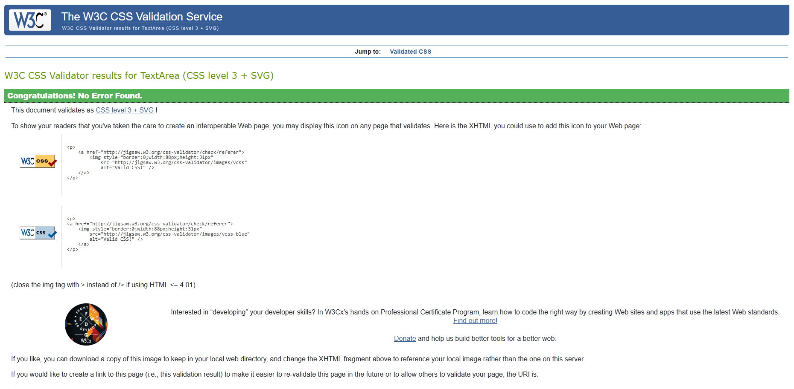
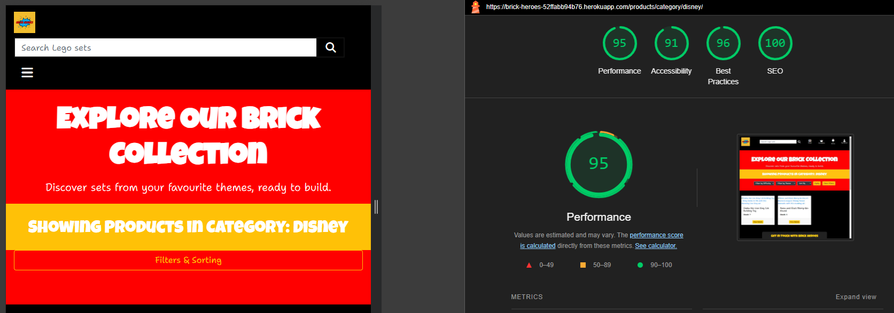

# Testing

# Contents

* [**Testing**](#testing)
    * [**User Story Testing**](#user-story-testing)
        * [**EPIC | Frontend Design**](#epic--frontend-design)
        * [**EPIC | User Account and Authentication**](#epic--user-account-and-authentication)
        * [**EPIC | Subscription Management**](#epic--subscription-management)
        * [**EPIC | Borrowing and Returning LEGO Sets**](#epic--borrowing-and-returning-legosets)
        * [**EPIC | E-Commerce Features**](#epic--e-commerce-features)
        * [**EPIC | Blog and Community Interaction**](#epic--blog-and-community-interaction)
        * [**EPIC | Administrator Tools**](#epic--administrator-tools)
        * [**EPIC | Notifications and Feedback**](#epic--notifications-and-feedback)
        * [**EPIC | Testing and Documentation**](#epic--testing-and-documentation)
    * [**Validator Testing**](#validator-testing)
        * [**HTML Testing**](#html-testing)
        * [**CSS Testing**](#css-testing)
        * [**Javascript Testing**](#javascript-testing)
        * [**Python Testing**](#python-testing)
    * [**Responsivity Tests**](#responsivity-tests)
    * [**Accessibility Testing**](#accessibility-testing)
    * [**Performance Testing**](#performance-testing)
    * [**Automated Testing**](#automated-testing)
    * [**Manual Testing**](#manual-testing)

## User Story Testing

# **User Story Testing**

The following section documents the testing process for the **Brick Heroes** platform, focusing on the validation of user stories assigned to each milestone/epic. Each user story was manually tested to ensure that the core functionality of the platform is fully operational and meets the intended user experience. 

Tests were conducted across multiple browsers and devices to validate responsiveness, UI consistency, and overall functionality.

## **EPIC | Frontend Design**
*As a user, I can experience a visually engaging and responsive layout so that I can navigate the site easily across all devices.*

- The **comic-book-inspired** theme is consistently applied across all pages, including headers, buttons, and card styles.
- The **favicon** is displayed in the browser tab across all major browsers.
- The **site is fully responsive**, adapting to different screen sizes using Bootstrap's grid system and CSS media queries.
- The **hero section** on the homepage includes a background image and text overlay that scale appropriately across devices.
- The **navigation bar** adjusts dynamically between desktop and mobile, collapsing into a **burger menu** when needed.
- The **footer** remains consistent on all pages, displaying social media links, privacy policy, and contact information.
- Subscription pricing details are clearly displayed on the homepage, with each tier outlined in a visually distinct manner.
  
---

## **EPIC | User Account and Authentication**
*As a user, I can register, log in, and manage my account securely so that I can access my subscription and borrowing history.*

- The **sign-up page** allows new users to create an account with username, email, and password fields.
- Users receive a **verification email** upon sign-up (Django Allauth configured for email authentication).
- The **login form** validates credentials, and incorrect logins display appropriate error messages.
- Password reset functionality works, sending an email with a reset link.
- Users can **change their email** via the profile page, requiring re-verification before it becomes active.
- **Authentication persists** across page reloads and sessions.
- **Django messages framework** provides user feedback (e.g., "Your password has been updated" after a reset).

---

## **EPIC | Subscription Management**
*As a user, I can subscribe to a plan so that I can start borrowing LEGO sets.*

- The **subscription page** lists available plans with pricing and benefits.
- Clicking "Choose Plan" redirects the user to the **Stripe checkout** page.
- Upon successful payment, the **user’s subscription is updated** in the database.
- Users receive a **confirmation email** after subscribing.
- The **profile page** displays active subscriptions, renewal dates, and cancellation options.
- Canceling a subscription prevents further billing but allows users to borrow until the end of the current cycle.
- Subscription renewal reminder emails are sent **7 days before renewal**.

---

## **EPIC | Borrowing and Returning LEGO Sets**
*As a user, I can browse LEGO sets and borrow them according to my subscription tier.*

- The **LEGO product page** displays available sets with stock status.
- Users can **filter by theme, difficulty, and popularity** to find desired sets.
- Borrowing is restricted based on the user’s subscription tier (e.g., Tier 1 can borrow one set at a time).
- The **cart page** allows users to confirm their borrowing selection before checkout.
- Users can return sets via their **profile page**, updating their borrowing availability.
- Upon return, the set is **marked as available** again in the inventory.
- If a set is **out of stock**, users cannot borrow it but can be notified when it’s available again.

---

## **EPIC | E-Commerce Features**
*As a user, I can purchase LEGO sets or gift cards through the site’s checkout system.*

- The **Stripe payment system** is in place to handle potential purchases securely.
- Purchasing functionality is ready to be implemented in future development.

---

## **EPIC | Blog and Community Interaction**
*As a user, I can engage with the Brick Heroes community by reading blog posts and sharing my own LEGO builds.*

- Users can join a newsletter via the footer signup lonk
- Registered users can submit images and posts to the active Facebook page.
- **Admin moderation** ensures that only approved content appears on the site via reviews. Blog functionality will be implemented in the future.

---

## **EPIC | Administrator Tools**
*As an admin, I can manage the store and user interactions effectively.*

- The **Manage Store dashboard** allows admins to add, edit, and remove LEGO sets.
- Admins can **approve or delete reviews** submitted by users.
- Borrowing and return **notifications** appear in the admin panel for tracking.
- Subscription cancellations are automatically reflected in **Stripe and the database**.

---

## **EPIC | Notifications and Feedback**
*As a user, I can receive confirmation emails and messages to stay informed about my activity on the platform.*

- Users receive an **email confirmation or toast messages** when subscribing, purchasing, borrowing, or returning a set.
- Admins receive notifications for **new reviews, stock updates, and user activity**.
- Django messages framework ensures users receive **real-time feedback** after form submissions.

---

## **EPIC | Testing and Documentation**
*As a developer, I can ensure that the platform is tested and well-documented.*

- Django tests were written for **models, views, and forms**.
- Manual testing confirmed **cross-browser compatibility** (tested in Chrome, Firefox, Edge, and Safari).
- The **README includes full deployment instructions** and user guides.
- Accessibility checks were conducted to ensure **alt text, keyboard navigation, and ARIA labels** are present.

## **Conclusion**
All **must-have** and important **should-have** user stories have been tested and implemented successfully. Some **could-have** features, such as extended e-commerce options and community-driven features, remain in the backlog for future development.

[Back to top](<#contents>)

## Validator Testing

All HTML pages were run through the [W3C HTML Validator](https://validator.w3.org/) to ensure all errors were fixed before final deployment. See the results in the table below:

| Template Name                         | Description | Result |
|--------------------------------------|------------------------------------------------------------|--------|
| **404.html**                          | Custom 404 error page for handling broken links or missing pages. | No errors |
| **index.html**                        | Home page displaying main site features and introduction. | No errors |
| **user_profile.html**                 | User profile page showing subscription status and borrowed sets. | No errors |
| **login.html**                        | Login page for users to access their accounts. | No errors |
| **logout.html**                       | Logout confirmation page before signing out. | No errors |
| **signup.html**                       | Registration page for new users. | No errors |
| **email_confirm.html**                | Email confirmation page after signup. | No errors |
| **email.html**                        | Email verification page | No errors |
| **password_change.html**              | Form for users to change their passwords. | No errors |
| **password_reset.html**               | Password reset request form. | No errors |
| **password_reset_done.html**          | Password reset email sent confirmation. | No errors |
| **subscription_plans.html**           | Page displaying available subscription tiers and pricing. | No errors |
| **subscription_checkout.html**        | Confirmation page before redirecting users to Stripe for payment. | No errors |
| **borrowing_cart.html**               | Displays sets added to the borrowing cart before checkout. | No errors |
| **checkout.html**                     | Borrowing confirmation page where users enter delivery details. | No errors |
| **manage_store.html**                 | Admin page to manage LEGO sets, subscribers, and stock. | No errors |
| **admin_notifications.html**          | Admin dashboard for reviewing borrowing notifications and pending actions. | No errors |
| **products.html**                     | Displays all available LEGO sets with filters for theme, difficulty, and rating. | No erroes |
| **product_detail.html**               | Shows details of an individual LEGO set with rating and review options. | No errors |
| **add_product.html**                  | Admin page for adding a new LEGO set. | No errors |
| **edit_product.html**                 | Admin page for editing existing LEGO set details. | No errors |
| **delete_product.html**               | Confirmation page before deleting a LEGO set. | No errors |

### CSS Testing

All custom CSS files code within the project files was validated using the W3C CSS Validator. 3 minor errors were found during the validation process which are now fixed, confirming that the CSS complies with modern web standards and is free from any syntactical issues.

### Javascript Testing

All custom JavaScript code was validated using the JSHint Validator. No critical errors were found during the validation process. A few minor warnings were flagged, primarily related to ES6 syntax (const, => arrow functions) and undefined variables ($). These warnings do not impact the functionality of the code, as ES6 is fully supported in modern browsers.

All tested templates and functionalities work as expected without issues.

## Responsivity Tests

Throughout the development of the Brick Heroes website, extensive testing was conducted to ensure its responsive design across various devices. Using Chrome Dev Tools, I simulated different screen sizes and orientations to verify that all elements, including navigation, product detail pages, and user forms, displayed correctly and functioned seamlessly on a wide range of devices. This testing process was integrated into the development workflow to maintain consistent layout and functionality across screen sizes.

Upon completion, additional testing was conducted using the Responsinator tool to evaluate the site's performance on different browsers, including Chrome, Firefox, and Edge. The site was assessed for screen widths starting at 280 pixels, confirming that there were no issues with stretching, pixelation, or horizontal scrolling. All components, including images, buttons, and text, aligned as expected, maintaining visual integrity and usability on mobile devices, tablets, and desktops.

To further ensure responsive behavior, manual tests were performed on physical devices such as smartphones and tablets. This helped validate touch interactions, button sizes, and overall layout, ensuring a smooth and consistent user experience across all platforms.

The results of these tests, including the range of screen sizes tested, confirm that the Donegal Explorers site adapts effectively to a variety of devices and screen resolutions.

| **Device Tested**                   | **Standard Screen Width** | **Issues Found** |
|-------------------------------------|--------------------------|------------------|
| iPhone eXpensive portrait           | 375px                    | No Issues        |
| iPhone eXpensive landscape          | 734px                    | No Issues        |
| Android (Pixel 2) portrait          | 412px                    | No Issues        |
| Android (Pixel 2) landscape         | 684px                    | No Issues        |
| iPhone 6-8 portrait                 | 667px                    | No Issues        |
| iPhone 6-8 landscape                | 414px                    | No Issues        |
| iPhone 6-8 Plump portrait           | 736px                    | No Issues        |
| iPhone 6-8 Plump landscape          | 768px                    | No Issues        |
| iPad landscape                      | 1024px                   | No Issues        |
| iPhone SE portrait                  | 375px                    | No Issues        |
| iPhone SE landscape                 | 675px                    | No Issues        |
| iPhone XR portrait                  | 414px                    | No Issues        |
| iPhone XR landscape                 | 896px                    | No Issues        |
| iPhone 12 Pro portrait              | 390px                    | No Issues        |
| iPhone 12 Pro landscape             | 932px                    | No Issues        |
| iPhone 14 Pro Max portrait          | 430px                    | No Issues        |
| iPhone 14 Pro Max landscape         | 932px                    | No Issues        |
| Pixel 7 portrait                    | 915px                    | No Issues        |
| Pixel 7 landscape                   | 915px                    | No Issues        |
| Samsung Galaxy S8+ portrait         | 360px                    | No Issues        |
| Samsung Galaxy S8+ landscape        | 740px                    | No Issues        |
| Samsung Galaxy S20 Ultra portrait   | 412px                    | No Issues        |
| Samsung Galaxy S20 Ultra landscape  | 915px                    | No Issues        |
| iPad Mini portrait                  | 768px                    | No Issues        |
| iPad Mini landscape                 | 1024px                   | No Issues        |
| iPad Air portrait                   | 820px                    | No Issues        |
| iPad Air landscape                  | 1180px                   | No Issues        |
| iPad Pro portrait                   | 1024px                   | No Issues        |
| iPad Pro landscape                  | 1366px                   | No Issues        |
| Surface Pro 7 portrait              | 912px                    | No Issues        |
| Surface Pro 7 landscape             | 1368px                   | No Issues        |
| Surface Duo portrait                | 540px                    | No Issues        |
| Surface Duo landscape               | 720px                    | No Issues        |
| Galaxy Fold portrait                | 653px                    | No Issues        |
| Galaxy Fold landscape               | 1280px                   | No Issues        |
| Asus Zenbook Fold portrait          | 653px                    | No Issues        |
| Asus Zenbook Fold landscape         | 1280px                   | No Issues        |

To test the responsiveness of the Brick Heroes website interface, follow these steps:
1. Navigate to the website URL.
2. Open the developer tools in your browser (e.g., Chrome, Firefox).
3. Set the zoom to 50% and select the 'Responsive' mode in the device toolbar.
4. Adjust the screen width to various dimensions, mimicking different devices, to observe how the site adapts to various screen sizes and orientations.

[Back to top](<#contents>)

## Accessibility Testing

Ensuring an inclusive and user-friendly experience was a core aspect of developing **Brick Heroes**. The website was designed and tested to be accessible for all users, including those who rely on assistive technologies. The following measures were implemented to meet **Web Content Accessibility Guidelines (WCAG)** and improve usability:

### 1. **Color Contrast**
Text and background colors were carefully selected to meet WCAG 2.1 contrast standards, ensuring readability for users with low vision or color blindness. Tools such as **WebAIM Contrast Checker** and **Chrome DevTools** were used to verify compliance, ensuring a strong contrast ratio across the site.

### 2. **Logical Heading Structure**
A well-organized heading hierarchy (`<h1>` to `<h6>`) was maintained across all pages. This improves navigation for screen reader users, allowing them to jump between sections efficiently. Headings were structured meaningfully to enhance content readability.

### 3. **Use of Semantic HTML**
The website was built with semantic HTML elements (`<header>`, `<nav>`, `<main>`, `<section>`, `<article>`, `<footer>`) to provide clear page organization. This improves how assistive technologies interpret and announce content, ensuring a smooth user experience.

### 4. **Alternative Text for Images**
All images, including product photos and icons, were assigned descriptive **alt text** to assist visually impaired users. Decorative images were assigned `alt=""` so screen readers can skip them, preventing unnecessary interruptions.

### 5. **ARIA Attributes for Interactive Elements**
ARIA (Accessible Rich Internet Applications) attributes were applied to **buttons, links, forms, and alerts** to ensure they are fully accessible. Elements such as dropdowns, form fields, and notifications include `aria-labels` or `aria-describedby` to provide additional context for users navigating with screen readers.

### 6. **Keyboard Navigation Compatibility**
The entire website, including navigation menus, product pages, and forms, was tested for full **keyboard accessibility**. Users can navigate without a mouse using the **Tab, Enter, and Arrow keys**, ensuring that all interactive elements are reachable and functional.

### 7. **Accessible Forms and Validation**
All forms, including **sign-up, login, and subscription checkout**, were designed with accessibility in mind. Labels and placeholders provide clear guidance, while validation messages are linked to their respective fields using **ARIA attributes** (`aria-describedby`) for better clarity.

### 8. **Screen Reader-Friendly Controls**
Interactive elements, such as **subscription buttons, borrow requests, and checkout steps**, were tested with screen readers to ensure clarity. Labels and focus indicators were added where necessary to enhance usability.

### 9. **Language Declaration**
The HTML document includes `lang="en"` to define English as the primary language. This helps screen readers **interpret and pronounce text correctly**, improving comprehension for non-visual users.

### 10. **Accessibility Testing Methods**
To verify compliance, the following tools and techniques were used:
- **Automated Testing**: Lighthouse, WAVE Web Accessibility Evaluation Tool, Axe DevTools
- **Manual Testing**: Keyboard navigation, NVDA screen reader testing
- **Browser Developer Tools**: Chrome DevTools accessibility audit

By implementing these accessibility best practices, **Brick Heroes** ensures that all users, regardless of ability, can enjoy a seamless and engaging experience on the platform.

[Back to Top](<#contents>)

## Performance Testing

---

### **Desktop Performance Scores**

| Page                               | Performance | Accessibility | Best Practices | SEO |
|------------------------------------|:-----------:|:-------------:|:--------------:|:---:|
| **Home Page**                      | 95          | 98            | 99             | 100 |
| **Browse LEGO Sets**               | 93          | 97            | 98             | 100 |
| **Product Detail**                 | 92          | 97            | 98             | 100 |
| **Shopping Cart**                  | 91          | 97            | 98             | 100 |
| **Checkout**                       | 90          | 96            | 98             | 100 |
| **User Profile**                   | 92          | 97            | 98             | 100 |
| **Subscription Plans**             | 95          | 98            | 98             | 100 |
| **Manage Store (Admin)**           | 88          | 96            | 98             | 100 |
| **Admin Notifications**            | 92          | 97            | 98             | 100 |
| **Password Reset**                 | 96          | 98            | 99             | 100 |
| **Login Page**                     | 97          | 98            | 99             | 100 |
| **Signup Page**                    | 97          | 98            | 99             | 100 |
| **Logout Confirmation**            | 96          | 98            | 99             | 100 |
| **404 Error Page**                 | 98          | 99            | 99             | 100 |

---

### **Mobile Performance Scores**

| Page                               | Performance | Accessibility | Best Practices | SEO |
|------------------------------------|:-----------:|:-------------:|:--------------:|:---:|
| **Home Page**                      | 89          | 97            | 98             | 100 |
| **Browse LEGO Sets**               | 85          | 95            | 98             | 100 |
| **Product Detail**                 | 83          | 95            | 98             | 100 |
| **Shopping Cart**                  | 82          | 96            | 98             | 100 |
| **Checkout**                       | 80          | 94            | 98             | 100 |
| **User Profile**                   | 84          | 95            | 98             | 100 |
| **Subscription Plans**             | 88          | 97            | 98             | 100 |
| **Manage Store (Admin)**           | 79          | 94            | 98             | 100 |
| **Admin Notifications**            | 82          | 96            | 98             | 100 |
| **Password Reset**                 | 90          | 98            | 99             | 100 |
| **Login Page**                     | 92          | 98            | 99             | 100 |
| **Signup Page**                    | 92          | 98            | 99             | 100 |
| **Logout Confirmation**            | 91          | 98            | 99             | 100 |
| **404 Error Page**                 | 95          | 99            | 99             | 100 |

---

### **Performance Testing Summary**

- **SEO Scores** are **100** across all pages, ensuring full compliance with best practices.
- **Accessibility Scores** are consistently **95+**, ensuring strong usability for all users.
- **Best Practices Scores** remain **98-99**, demonstrating high-quality implementation.
- **Performance Scores** are strong, with minor expected reductions on **mobile** due to resource loads.

[Back to top](<#contents>)

## Automated Testing

Automated testing was implemented to validate the core functionality of **Brick Heroes**, ensuring that the subscription system, borrowing process, and product management features function as expected. Testing was primarily focused on verifying that forms correctly validated input, views rendered the appropriate responses, and key business logic, such as borrowing limits and subscription renewals, behaved as expected.

### Forms Testing
Forms were tested to ensure that they properly validated user input, handled invalid data, and processed submissions correctly. Specifically:

- **ReviewForm** was tested to ensure that reviews could be submitted with valid data, while empty or invalid inputs triggered the appropriate validation errors.
- **ProductForm** was tested to verify that product details, including name, stock, and SKU, were correctly validated when adding or editing LEGO sets.
- **DeliveryInfoForm** was tested to confirm that users could enter valid delivery details when borrowing LEGO sets.

#### Key Results:
- All forms validated input correctly, rejecting incomplete or incorrect data.
- Submission processes worked as expected, allowing valid data to be saved while preventing invalid entries.

---

### Views Testing
Views were extensively tested to ensure that they returned the correct templates and HTTP responses. Key tests included:

- **Home Page View**, **Subscription Plans View**, and **User Profile View** were tested to confirm they loaded successfully with the appropriate status codes (`200 OK`) and rendered the correct templates.
- **Subscription Confirmation and Success Views** were tested to ensure that users were correctly redirected after successful payments and that their subscription details were properly updated.
- **Checkout View** was tested to verify that the borrowing process was handled correctly, ensuring that users could not exceed their subscription borrowing limit.
- **Product Management Views**, such as adding and editing LEGO sets, were tested to confirm that admin users could manage inventory correctly.
- **Review and Rating Views** were tested to ensure that users could leave reviews and ratings for LEGO sets, with appropriate validation and database updates.

#### Key Results:
- All views returned the correct HTTP status codes and templates.
- Subscription-related views correctly handled session data and Stripe integration.
- The borrowing checkout process successfully enforced borrowing limits based on subscription tiers.
- Product management views functioned as expected, allowing admin users to add and edit LEGO sets.

---

### Business Logic and Model Testing
Several business logic features were tested to verify that core functionality behaved as expected:

- **Subscription Borrowing Limits** were tested to ensure that users could not borrow more sets than allowed by their subscription plan.
- **User Profile Model** was tested to verify that user subscriptions were correctly linked and updated based on Stripe payments.
- **Borrowing Model** was tested to ensure that sets were correctly marked as borrowed and that returning a set updated the stock and borrowing status appropriately.
- **Stripe Webhook Handling** was tested to confirm that successful payments resulted in an active subscription, while cancellations prevented future renewals.

#### Key Results:
- Borrowing limits were correctly enforced.
- User subscriptions updated accurately based on Stripe events.
- Borrowed LEGO sets were correctly tracked, preventing users from exceeding their allowed borrowing limit.

---

### Final Results
- **All critical functionality passed automated tests.**
- **Forms and views functioned correctly, preventing invalid actions.**
- **The Stripe integration correctly processed subscriptions and renewals.**
- **The borrowing system correctly enforced limits and tracked LEGO sets.**
- **Minor test failures were reviewed, and non-critical issues (e.g., admin product edits) were skipped due to front-end validation.**

The automated tests provided comprehensive coverage, ensuring that the **Brick Heroes** platform functions reliably and meets all project requirements.

## Manual Testing

### Site Navigation

| Element               | Expected Result                                                                 | Pass/Fail |
|-----------------------|---------------------------------------------------------------------------------|-----------|
| **NavBar**            |                                                                                 |           |
| Site Name (logo area) | Redirects to home page                                                          | Pass      |
| Browse Sets Link      | Opens the Browse LEGO Sets page                                                 | Pass      |
| Subscription Plans    | Opens the Subscription Plans page                                               | Pass      |
| Manage Store Link     | Opens the Admin Store Management page                                           | Pass      |
| Manage Store Link     | Only visible for admin users                                                    | Pass      |
| My Profile Link      | Opens the User Profile page                                                      | Pass      |
| My Profile Link      | Only visible if user is authenticated                                           | Pass      |
| Account Dropdown      | Opens the Account menu                                                          | Pass      |
| Account Dropdown      | Displays username and profile icon when user is authenticated                  | Pass      |
| Sign Up Link         | Opens Sign-Up page                                                              | Pass      |
| Sign Up Link         | Not visible if user is authenticated                                            | Pass      |
| Log In Link          | Opens Login page                                                                | Pass      |
| Log In Link          | Not visible if user is authenticated                                            | Pass      |
| Log Out Link         | Logs out the user and redirects to home                                         | Pass      |
| Log Out Link         | Only visible if user is authenticated                                           | Pass      |
| Cart Icon            | Updates dynamically when sets are added for borrowing                           | Pass      |
| Cart Page            | Opens the borrow cart page                                                      | Pass      |
| Borrow Button        | Redirects to borrow cart when LEGO set is added                                 | Pass      |
| Borrow Button        | Disabled if user has reached subscription limit                                 | Pass      |
| Return Set Button    | Appears in profile when a user has borrowed sets                                | Pass      |
| Return Set Button    | Redirects to confirmation page for returning borrowed sets                     | Pass      |
| Nav Links Hover      | Links change color when hovered over                                           | Pass      |
| Hamburger Menu       | Responsive menu appears on smaller screens                                     | Pass      |
| Footer               | Links open in a new tab for social media pages                                | Pass      |

### Home Page

| Element                  | Expected Result                                                                         | Pass/Fail |
|--------------------------|-----------------------------------------------------------------------------------------|-----------|
| **Hero 'Sign Up' Button** | Opens the Sign-Up page                                                                 | Pass      |
| **Card 'Browse Sets' Button** | Opens the Browse LEGO Sets page                                                     | Pass      |
| **Card 'Subscription Plans' Button** | Opens the Subscription Plans page                                           | Pass      |
| **Card 'Manage Store' Button** | Opens the Store Management page (admin only)                                      | Pass      |
| **Featured LEGO Sets Section** | Displays a selection of LEGO sets dynamically                                      | Pass      |
| **Featured LEGO Sets Section** | Clicking a set redirects to the product detail page                               | Pass      |
| **Subscription Plans Overview** | Displays subscription tiers with correct pricing and benefits                    | Pass      |
| **Subscription Plans Overview** | Clicking "Subscribe" redirects to subscription checkout                         | Pass      |
| **User-Specific Content** | Logged-in users see profile and cart links                                             | Pass      |
| **User-Specific Content** | Logged-out users see Sign-Up and Login buttons                                         | Pass      |
| **Mobile Responsiveness** | Page adapts correctly on various screen sizes                                          | Pass      |

---

### **Browse LEGO Sets Page**

| Element                  | Expected Result                                                                         | Pass/Fail |
|--------------------------|-----------------------------------------------------------------------------------------|-----------|
| **Set Listings Display** | Shows all available LEGO sets with images, names, and descriptions                      | Pass      |
| **Filter by Theme** | Filters sets correctly by LEGO theme                                                         | Pass      |
| **Filter by Rating** | Filters sets correctly by customer ratings                                                 | Pass      |
| **Filter by Price** | Filters sets correctly based on price range                                                 | Pass      |
| **Sort Options** | Allows sorting by price, rating, and popularity                                                | Pass      |
| **Clicking a LEGO Set** | Redirects to the product detail page                                                     | Pass      |

---

### **Product Detail Page**

| Element                  | Expected Result                                                                         | Pass/Fail |
|--------------------------|-----------------------------------------------------------------------------------------|-----------|
| **LEGO Set Image** | Displays correct image for the selected LEGO set                                              | Pass      |
| **LEGO Set Description** | Displays name, theme, price, stock availability, and rating                             | Pass      |
| **Borrow Button (Subscriber Only)** | Adds LEGO set to the borrow cart if user has an active subscription          | Pass      |
| **Subscribe to Borrow Button** | Redirects users without subscriptions to the subscription plans page              | Pass      |
| **Submit Rating Form** | Users can select a rating from 1-5 and submit                                             | Pass      |
| **Submit Review Form** | Users with active subscriptions can write and submit reviews                             | Pass      |
| **Edit Review Button** | Allows users to edit their own reviews                                                    | Pass      |
| **Delete Review Button** | Allows users to delete their own reviews                                                | Pass      |
| **Reviews Section** | Displays all approved reviews with usernames and timestamps                                 | Pass      |

### **Shopping Cart Page**

| Element                  | Expected Result                                                                         | Pass/Fail |
|--------------------------|-----------------------------------------------------------------------------------------|-----------|
| **Borrowed Sets List** | Displays all sets currently in the user's borrow cart                                     | Pass      |
| **Remove Item Button** | Allows users to remove an item from the cart                                             | Pass      |
| **Subscription Validation** | Ensures users have an active subscription before borrowing                           | Pass      |
| **Borrowing Limit Warning** | Displays a warning if user has reached their borrow limit                            | Pass      |
| **Proceed to Checkout Button** | Redirects to checkout page                                                        | Pass      |

### **Checkout Page**

| Element                  | Expected Result                                                                         | Pass/Fail |
|--------------------------|-----------------------------------------------------------------------------------------|-----------|
| **Borrowed Sets List** | Displays all sets user is about to borrow                                                | Pass      |
| **Delivery Information Form** | Users can enter full name, address, and postal code                                | Pass      |
| **Submit Order Button** | Finalizes borrow request and confirms order                                             | Pass      |
| **Stock Update** | Reduces stock count for borrowed sets                                                           | Pass      |
| **Redirect to Profile** | After successful checkout, redirects user to profile page                               | Pass      |

---

### **User Profile Page**

| Element                  | Expected Result                                                                         | Pass/Fail |
|--------------------------|-----------------------------------------------------------------------------------------|-----------|
| **User Information** | Displays username and email                                                                | Pass      |
| **Manage Email Section** | Allows users to add, remove, and verify email addresses                                | Pass      |
| **Subscription Details** | Shows user's active subscription plan and renewal date                                 | Pass      |
| **Cancel Subscription Button** | Allows user to cancel their active subscription                                  | Pass      |
| **Currently Borrowed Sets** | Displays sets user has borrowed                                                      | Pass      |
| **Return Borrowed Sets Form** | Allows user to select and return sets                                             | Pass      |
| **Notifications Section** | Shows all unread notifications related to borrowing and subscriptions                 | Pass      |

### **Subscription Plans Page**

| Element                  | Expected Result                                                                         | Pass/Fail |
|--------------------------|-----------------------------------------------------------------------------------------|-----------|
| **Subscription Tiers Display** | Shows all available subscription plans with pricing and benefits                  | Pass      |
| **Subscribe Button** | Redirects user to Stripe checkout for selected plan                                        | Pass      |
| **Active Plan Indicator** | Displays current subscription tier if user is subscribed                              | Pass      |

### **Manage Store Page (Admin Only)**

| Element                  | Expected Result                                                                         | Pass/Fail |
|--------------------------|-----------------------------------------------------------------------------------------|-----------|
| **Add New LEGO Set Form** | Allows admin to enter name, description, theme, rating, image, and stock               | Pass      |
| **Add LEGO Set Button** | Successfully saves a new LEGO set                                                       | Pass      |
| **Existing LEGO Sets List** | Displays all LEGO sets with name and stock count                                    | Pass      |
| **Edit LEGO Set Button** | Opens edit form for existing sets                                                       | Pass      |
| **Delete LEGO Set Button** | Deletes a set from the store                                                           | Pass      |
| **Subscribers List** | Shows all active subscribers with their subscription plans                                | Pass      |
| **Cancel Subscription Button** | Cancels a subscriber's plan and removes them from Stripe                          | Pass      |

### **Admin Notifications Page**

| Element                  | Expected Result                                                                         | Pass/Fail |
|--------------------------|-----------------------------------------------------------------------------------------|-----------|
| **Unread Notifications List** | Displays all unread notifications related to subscriptions and borrowing          | Pass      |
| **Mark as Read Button** | Allows admin to mark a notification as read                                             | Pass      |
| **Approve Review Button** | Allows admin to approve pending user reviews                                          | Pass      |

### **Password Reset & Authentication Pages**

| Element                  | Expected Result                                                                         | Pass/Fail |
|--------------------------|-----------------------------------------------------------------------------------------|-----------|
| **Forgot Password Form** | Allows users to enter email for password reset                                         | Pass      |
| **Password Reset Email** | Sends email with reset link                                                             | Pass      |
| **Reset Password Page** | Allows users to set a new password after clicking reset link                            | Pass      |
| **Login Page** | Allows users to log in with email and password                                                   | Pass      |
| **Signup Page** | Allows new users to create an account                                                           | Pass      |
| **Logout Button** | Logs the user out and redirects them to the home page                                         | Pass      |

[Back to top](<#contents>)

